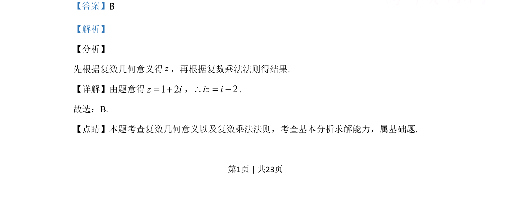

## 题面

## 摘要

根据复数几何意义求复数，再运用复数乘法法则计算。

## 关联考点

- [[333-复数的几何意义|复数几何意义]]
- [[332-复数的乘除运算|复数乘法]]

## 答案与解析

> 📄 原 PDF 第 1 页：`素材/真题/北京/2008-2024·（北京）数学高考真题/2020年高考数学试卷（北京）（解析卷）.pdf`

<!-- 题干文本-start -->
## 题干文本
2.在复平面内，复数z对应的点的坐标是(1, 2)，则i z× =（    ）．
A. 1 2i+B. 2i- +C. 1 2i-D. 2i- -
<!-- 题干文本-end -->

<!-- 解析文本-start -->
## 解析文本
【答案】B
【解析】
【分析】
先根据复数几何意义得z，再根据复数乘法法则得结果.
【详解】由题意得1 2z i= +，2iz i\ = -.
故选：B.
【点睛】本题考查复数几何意义以及复数乘法法则，考查基本分析求解能力，属基础题.
<!-- 解析文本-end -->
