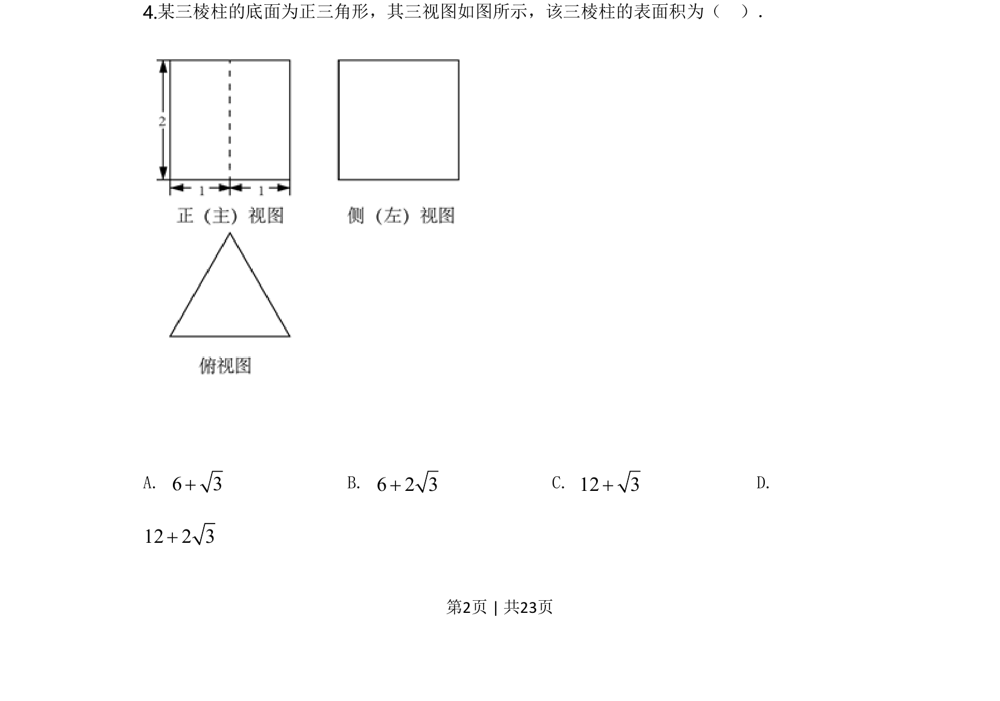
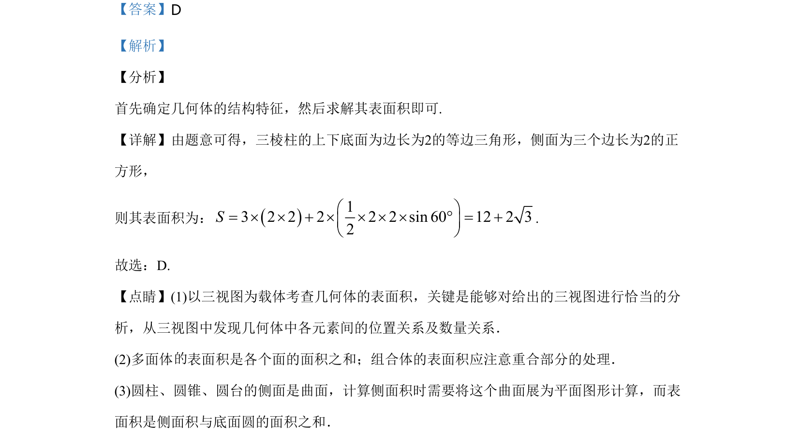

## 题面

## 摘要

该题通过三视图还原三棱柱结构，计算其表面积。

## 关联考点

- [[235-三视图|三视图]]
- [[349-空间几何体表面积|空间几何体表面积]]
- [[934-棱柱的结构特征|棱柱的结构特征]]

## 答案与解析

> 📄 原 PDF 第 2 页：`素材/真题/北京/2008-2024·（北京）数学高考真题/2020年高考数学试卷（北京）（解析卷）.pdf`
