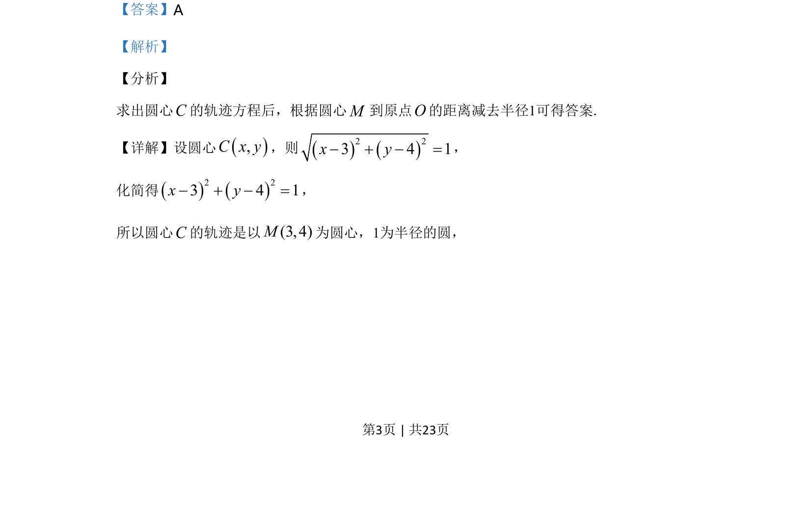
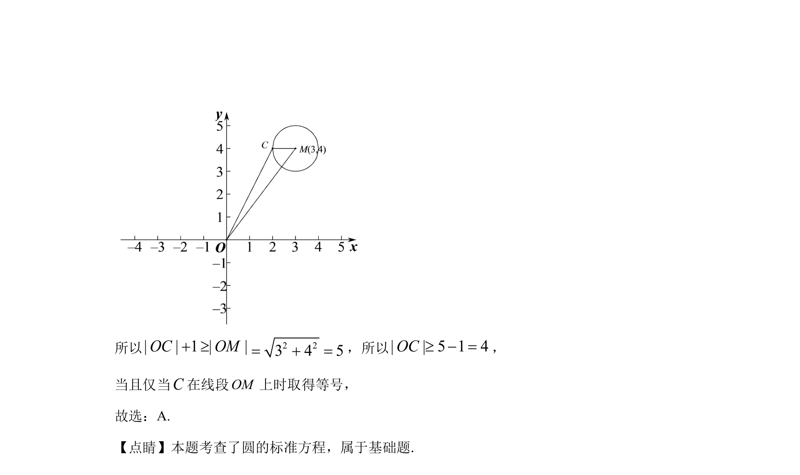

## 题面

## 摘要

求动圆圆心的轨迹方程，并利用几何性质求圆心到原点距离的最小值

## 关联考点

- [[373-圆的标准方程|圆的标准方程]]
- [[715-动点轨迹|动点轨迹]]
- [[626-两点间距离公式|两点间距离公式]]
- [[914-最值问题|最值问题]]

## 答案与解析

> 📄 原 PDF 第 3 页：`素材/真题/北京/2008-2024·（北京）数学高考真题/2020年高考数学试卷（北京）（解析卷）.pdf`
