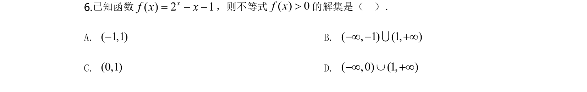
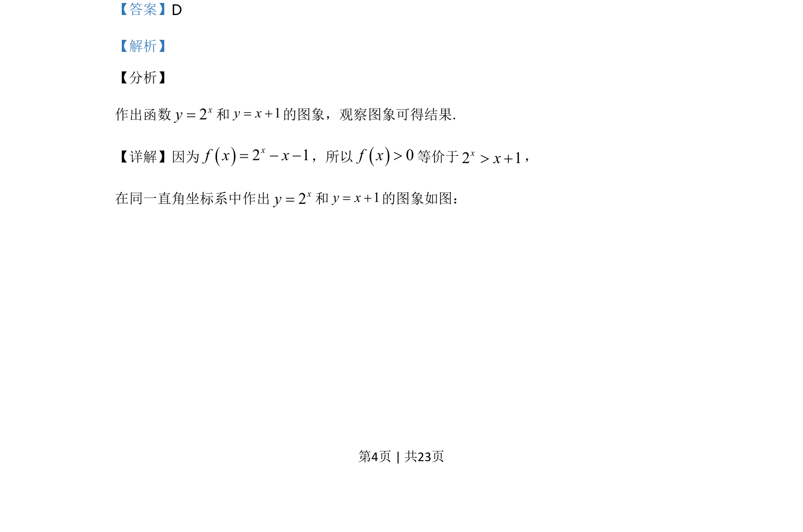
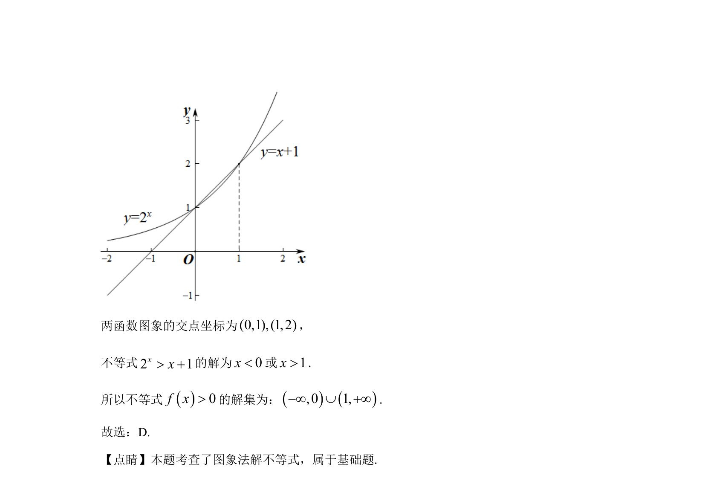

## 题面

## 摘要

利用函数图象求解指数函数与一次函数构成的不等式解集。

## 关联考点

- [[187-函数图象|函数图象]]
- [[304-指数函数|指数函数]]
- [[177-一次函数定义|一次函数]]
- [[1108-解不等式|解不等式]]

## 答案与解析

> 📄 原 PDF 第 4 页：`素材/真题/北京/2008-2024·（北京）数学高考真题/2020年高考数学试卷（北京）（解析卷）.pdf`
