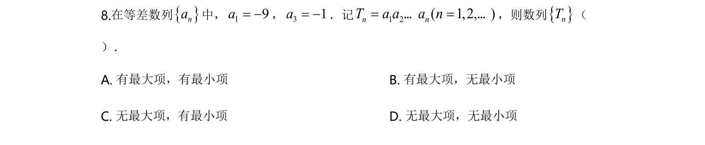
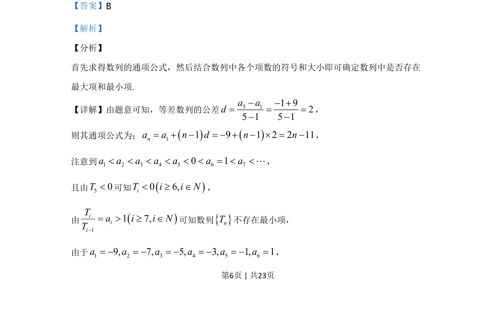
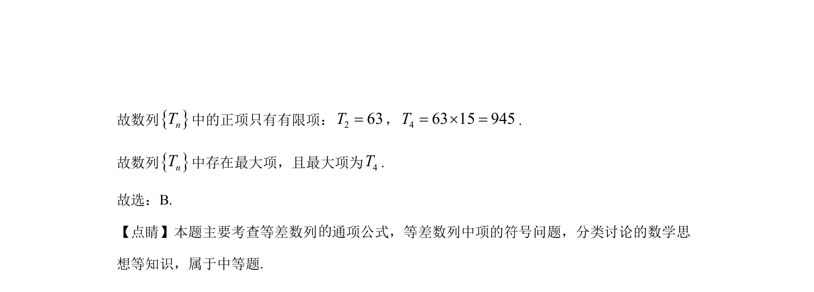

## 题面

## 摘要

已知等差数列部分项，求通项公式并判断其前n项积构成的数列是否存在最大项和最小项。

## 关联考点

- [[1063-等差数列通项公式|等差数列通项公式]]
- [[455-数列单调性|数列单调性]]
- [[最大项与最小项]]

## 答案与解析

> 📄 原 PDF 第 6 页：`素材/真题/北京/2008-2024·（北京）数学高考真题/2020年高考数学试卷（北京）（解析卷）.pdf`
