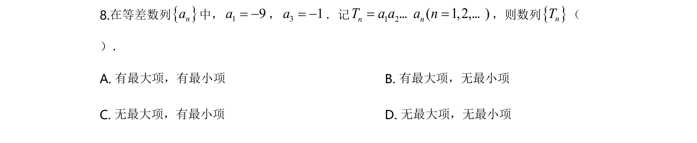
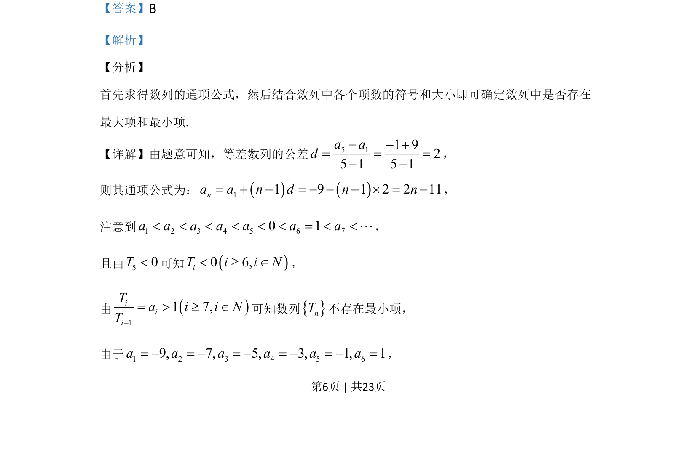
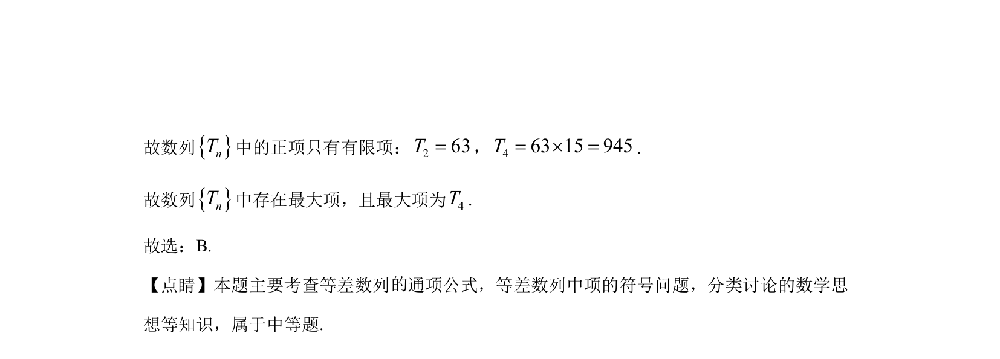

## 题面

## 摘要

已知等差数列部分项，求通项公式并判断其前n项积构成的数列是否存在最大项和最小项。

## 关联考点

- [[1063-等差数列通项公式|等差数列通项公式]]
- [[455-数列单调性|数列单调性]]
- [[最大项与最小项]]

## 答案与解析

> 📄 原 PDF 第 6 页：`素材/真题/北京/2008-2024·（北京）数学高考真题/2020年高考数学试卷（北京）（解析卷）.pdf`

<!-- 题干文本-start -->
## 题干文本
8.在等差数列{}na中，19a= -，31a= -．记 1 2( 1,2, )n nT a a a n= =……，则数列{}nT（    
）．
A. 有最大项，有最小项 B. 有最大项，无最小项
C. 无最大项，有最小项 D. 无最大项，无最小项
<!-- 题干文本-end -->

<!-- 解析文本-start -->
## 解析文本
【答案】B
【解析】
【分析】
首先求得数列的通项公式，然后结合数列中各个项数的符号和大小即可确定数列中是否存在
最大项和最小项.
【详解】由题意可知，等差数列的公差5 11 925 1 5 1a ad-- += = =- -
，
则其通项公式为：()()11 9 1 2 2 11na a n d n n= + - = - + - ´ = -，
注意到1 2 3 4 5 6 70 1a a a a a a a< < < < < < = < <L，
且由50T<可知()0 6,iT i i N< ³ Î，
由()11 7,iiiTa i i NT-= > ³ Î可知数列{}nT不存在最小项，
由于1 2 3 4 5 69, 7, 5, 3, 1, 1a a a a a a= - = - = - = - = - =，
<!-- 解析文本-end -->
