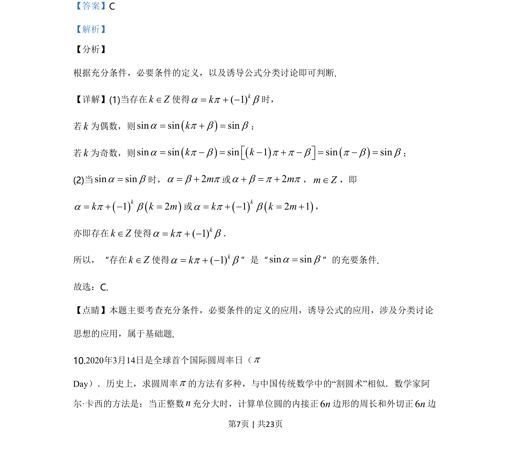

## 题面

## 摘要

本题主要考查充分必要条件的定义，结合诱导公式和分类讨论判断三角等式关系。

## 关联考点

- [[533-充分必要条件|充分条件与必要条件]]
- [[1249-三角函数的诱导公式|诱导公式]]
- [[424-参数分类讨论|分类讨论]]

## 答案与解析

> 📄 原 PDF 第 7 页：`素材/真题/北京/2008-2024·（北京）数学高考真题/2020年高考数学试卷（北京）（解析卷）.pdf`
