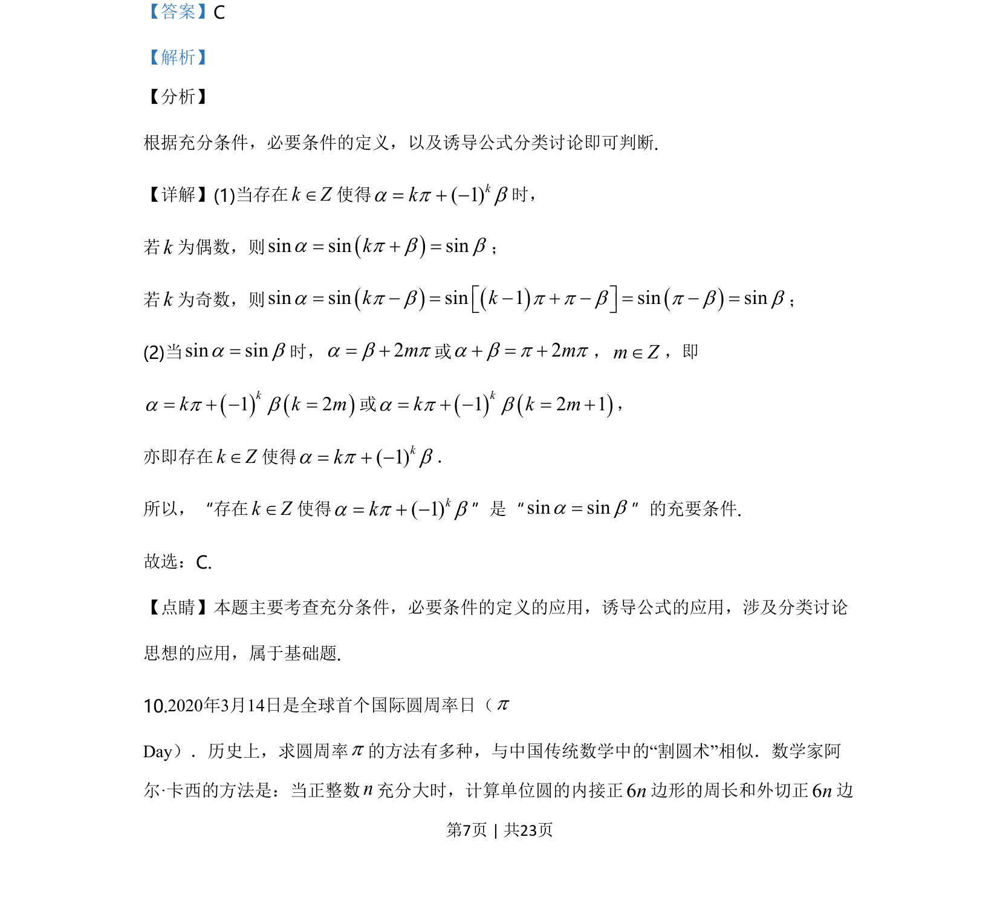

## 题面

## 摘要

本题主要考查充分必要条件的定义，结合诱导公式和分类讨论判断三角等式关系。

## 关联考点

- [[533-充分必要条件|充分条件与必要条件]]
- [[1249-三角函数的诱导公式|诱导公式]]
- [[424-参数分类讨论|分类讨论]]

## 答案与解析

> 📄 原 PDF 第 7 页：`素材/真题/北京/2008-2024·（北京）数学高考真题/2020年高考数学试卷（北京）（解析卷）.pdf`

<!-- 题干文本-start -->
## 题干文本
9.已知,Ra bÎ，则“存在k ZÎ使得( 1)kka p b= + -”是“sin sina b=”的（    ）．
A. 充分而不必要条件 B. 必要而不充分条件
C. 充分必要条件 D. 既不充分也不必要条件
<!-- 题干文本-end -->

<!-- 解析文本-start -->
## 解析文本
【答案】C
【解析】
【分析】
根据充分条件，必要条件的定义，以及诱导公式分类讨论即可判断.
【详解】(1)当存在k ZÎ使得( 1)kka p b= + -时，
若k为偶数，则sin sin sinka p b b= + =；
若k为奇数，则sin sin sin 1 sin sink ka p b p p b p b b= - = - + - = - =é ùë û；
(2)当sin sina b=时，2ma b p= +或 2ma b p p+ = +，m ZÎ，即
1 2kk k ma p b= + - =或1 2 1kk k ma p b= + - = +，
亦即存在k ZÎ使得( 1)kka p b= + -．
所以，“存在k ZÎ使得( 1)kka p b= + -”是“sin sina b=”的充要条件.
故选：C.
【点睛】本题主要考查充分条件，必要条件的定义的应用，诱导公式的应用，涉及分类讨论
思想的应用，属于基础题.
<!-- 解析文本-end -->
