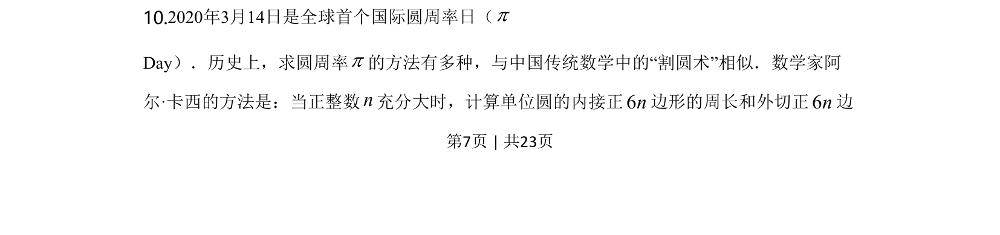
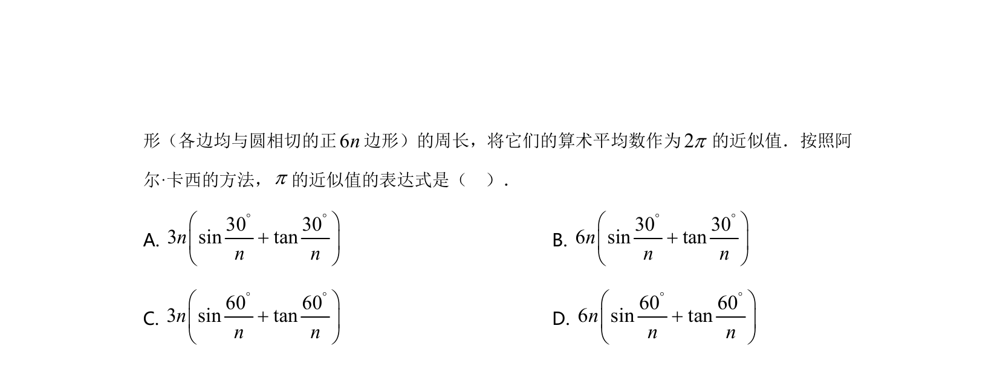
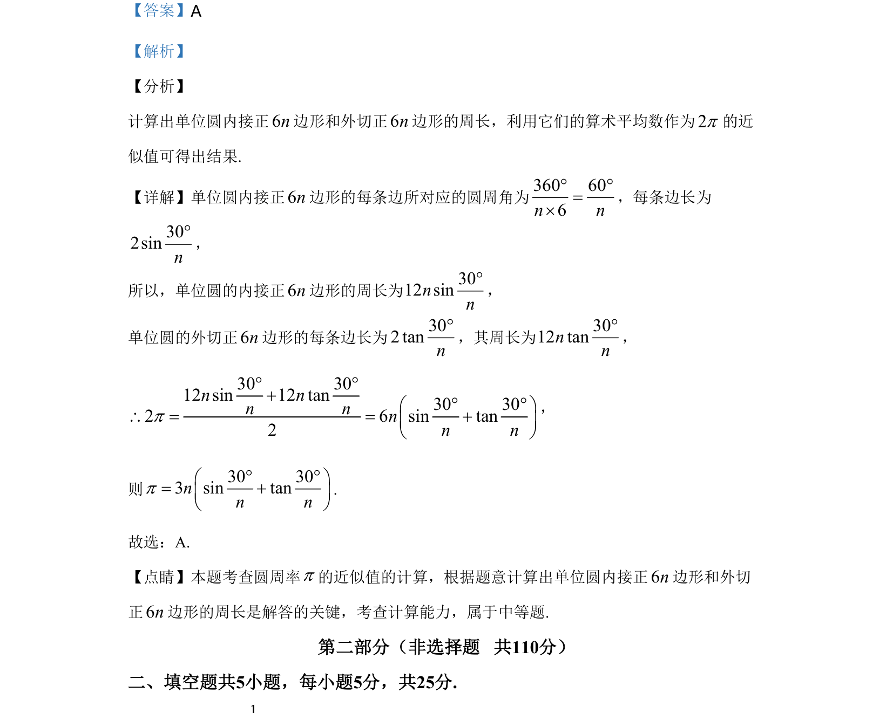

## 题面

## 摘要

利用单位圆的内接和外切正多边形周长逼近圆周率π的计算。

## 关联考点

- [[正多边形周长]]
- [[圆周率近似]]
- [[270-三角函数应用|三角函数]]

## 答案与解析

> 📄 原 PDF 第 7 页：`素材/真题/北京/2008-2024·（北京）数学高考真题/2020年高考数学试卷（北京）（解析卷）.pdf`

<!-- 题干文本-start -->
## 题干文本
10.2020年3月14日是全球首个国际圆周率日（p 
Day）．历史上，求圆周率p的方法有多种，与中国传统数学中的“割圆术”相似．数学家阿
尔·卡西的方法是：当正整数n充分大时，计算单位圆的内接正6n边形的周长和外切正6n边
的
<!-- 题干文本-end -->

<!-- 解析文本-start -->
## 解析文本

<!-- 解析文本-end -->
