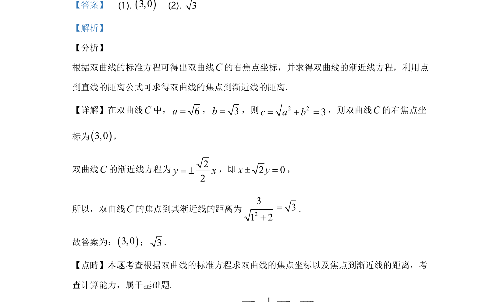

## 题面

## 摘要

求双曲线的焦点坐标及焦点到渐近线的距离，考查计算能力。

## 关联考点

- [[732-双曲线的标准方程|双曲线的标准方程]]
- [[1218-焦点坐标|焦点坐标]]
- [[976-渐近线方程|渐近线方程]]
- [[981-点到直线的距离|点到直线的距离]]

## 答案与解析

> 📄 原 PDF 第 9 页：`素材/真题/北京/2008-2024·（北京）数学高考真题/2020年高考数学试卷（北京）（解析卷）.pdf`
