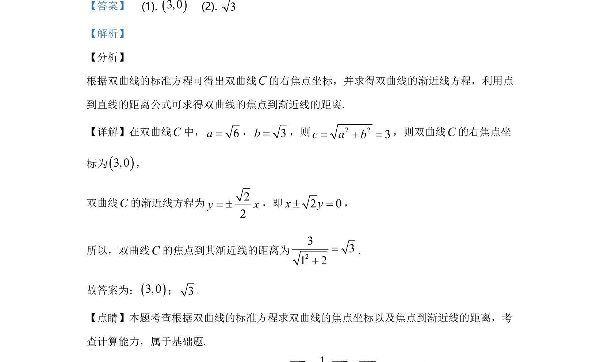

## 题面

## 摘要

求双曲线的焦点坐标及焦点到渐近线的距离，考查计算能力。

## 关联考点

- [[732-双曲线的标准方程|双曲线的标准方程]]
- [[1217-焦点坐标|焦点坐标]]
- [[975-渐近线方程|渐近线方程]]
- [[1211-点到直线距离|点到直线的距离]]

## 答案与解析

> 📄 原 PDF 第 9 页：`素材/真题/北京/2008-2024·（北京）数学高考真题/2020年高考数学试卷（北京）（解析卷）.pdf`

<!-- 题干文本-start -->
## 题干文本
12.已知双曲线
2 2: 16 3x yC- =，则C的右焦点的坐标为_________；C的焦点到其渐近线的距
离是_________．
<!-- 题干文本-end -->

<!-- 解析文本-start -->
## 解析文本
【答案】    (1). ()3,0    (2). 3
【解析】
【分析】
根据双曲线的标准方程可得出双曲线C的右焦点坐标，并求得双曲线的渐近线方程，利用点
到直线的距离公式可求得双曲线的焦点到渐近线的距离.
【详解】在双曲线C中，6a=，3b=，则 2 23c a b= + =，则双曲线C的右焦点坐
标为()3,0，
双曲线C的渐近线方程为22y x= ±，即2 0x y± =，
所以，双曲线C的焦点到其渐近线的距离为2331 2=+
.
故答案为：()3,0；3.
【点睛】本题考查根据双曲线的标准方程求双曲线的焦点坐标以及焦点到渐近线的距离，考
查计算能力，属于基础题.
<!-- 解析文本-end -->
