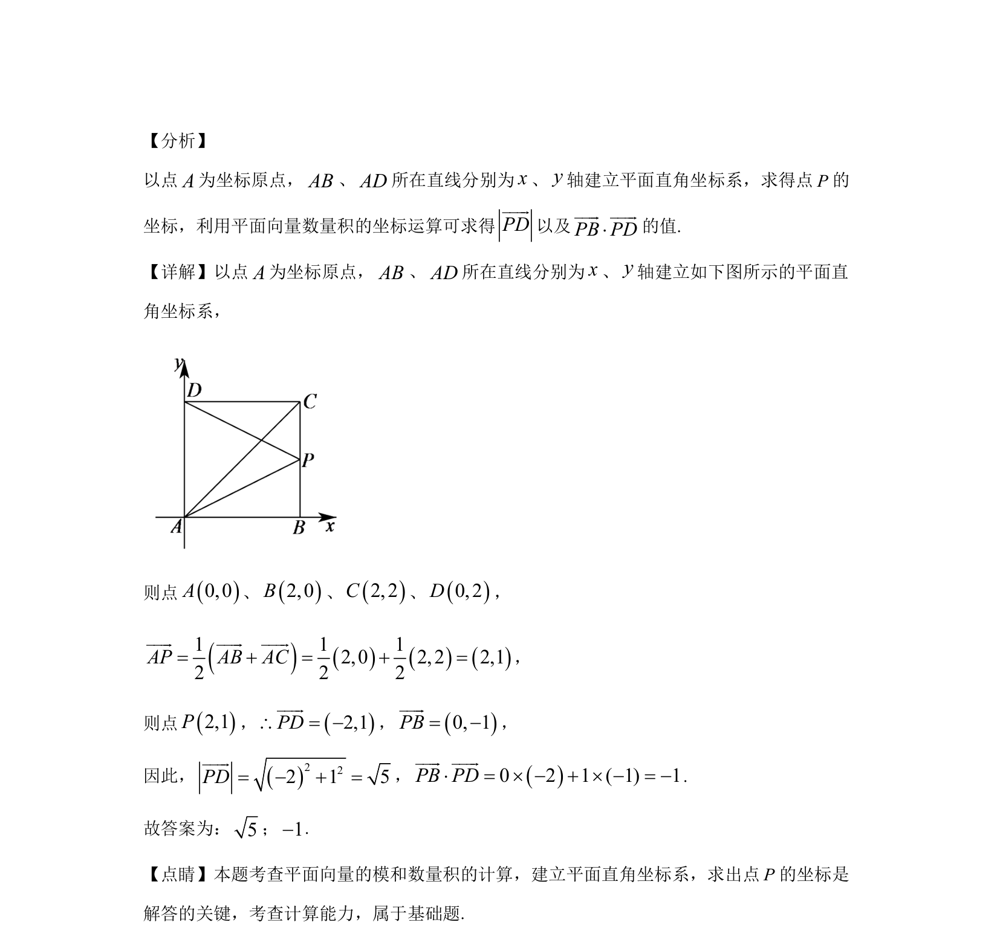

## 题面

## 摘要

建立平面直角坐标系，求向量坐标，计算向量的模和数量积。

## 关联考点

- [[335-平面向量坐标运算|平面向量坐标运算]]
- [[752-向量模长|向量的模]]
- [[854-平面向量数量积|平面向量数量积]]

## 答案与解析

> 📄 原 PDF 第 9 页：`素材/真题/北京/2008-2024·（北京）数学高考真题/2020年高考数学试卷（北京）（解析卷）.pdf`
