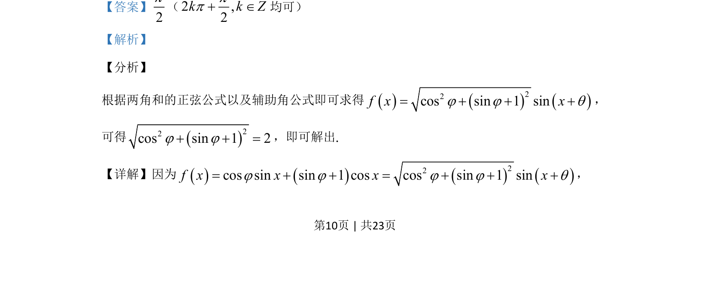
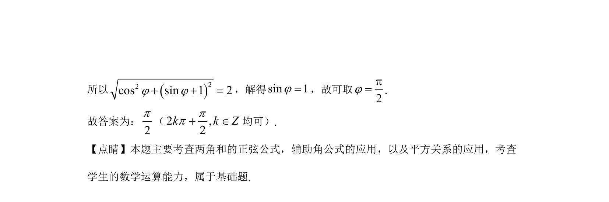

## 题面

## 摘要

本题考查利用两角和正弦公式与辅助角公式进行三角函数化简，通过平方关系求参数值。

## 关联考点

- [[634-两角和的正弦公式|两角和的正弦公式]]
- [[1127-辅助角公式|辅助角公式]]
- [[1156-平方关系|平方关系]]

## 答案与解析

> 📄 原 PDF 第 10 页：`素材/真题/北京/2008-2024·（北京）数学高考真题/2020年高考数学试卷（北京）（解析卷）.pdf`
