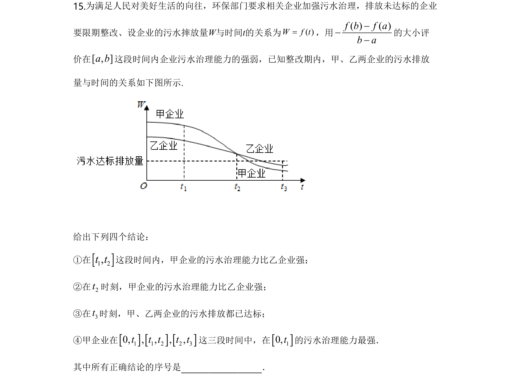
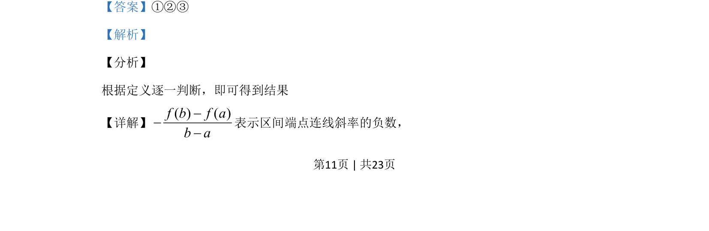
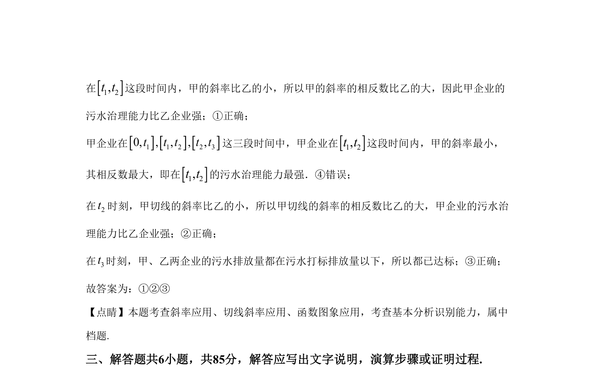

## 题面

## 摘要

本题考查函数图象斜率与切线斜率的实际意义，判断企业治污能力强弱。

## 关联考点

- [[斜率应用]]
- [[切线斜率应用]]
- [[函数图象应用]]
- [[基本分析识别]]

## 答案与解析

> 📄 原 PDF 第 11 页：`素材/真题/北京/2008-2024·（北京）数学高考真题/2020年高考数学试卷（北京）（解析卷）.pdf`

<!-- 题干文本-start -->
## 题干文本
15.为满足人民对美好生活的向往，环保部门要求相关企业加强污水治理，排放未达标的企业
要限期整改、设企业的污水摔放量W与时间t的关系为( )W f t=，用( ) ( )f b f ab a---
的大小评
价在[ , ]a b这段时间内企业污水治理能力的强弱，已知整改期内，甲、乙两企业的污水排放
量与时间的关系如下图所示.
给出下列四个结论：
①在1 2,t t这段时间内，甲企业的污水治理能力比乙企业强；
②在2t时刻，甲企业的污水治理能力比乙企业强；
③在3t时刻，甲、乙两企业的污水排放都已达标；
④甲企业在1 1 2 2 30, , , , ,t t t t t这三段时间中，在10,t的污水治理能力最强．
其中所有正确结论的序号是____________________．
<!-- 题干文本-end -->

<!-- 解析文本-start -->
## 解析文本
【答案】①②③
【解析】
【分析】
根据定义逐一判断，即可得到结果
【详解】( ) ( )f b f ab a---
表示区间端点连线斜率的负数，
<!-- 解析文本-end -->
