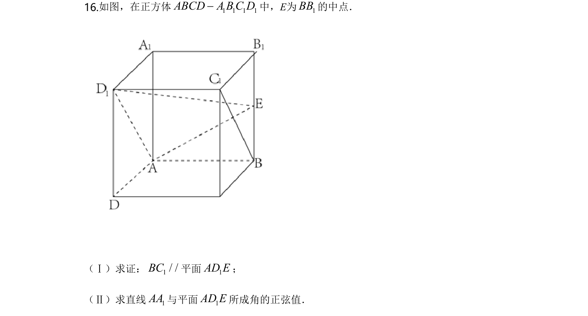
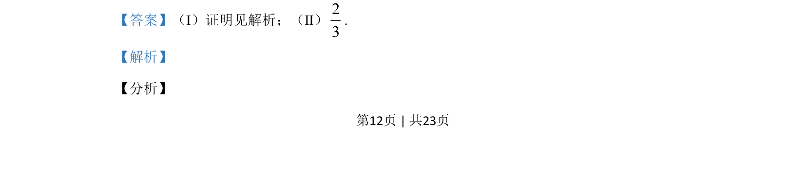
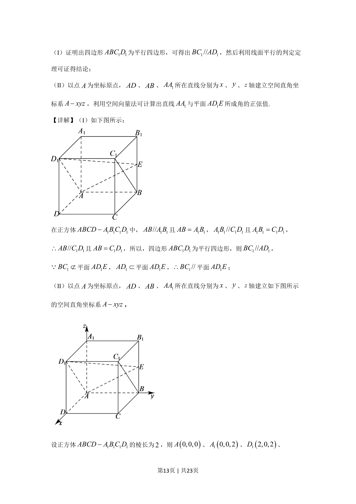
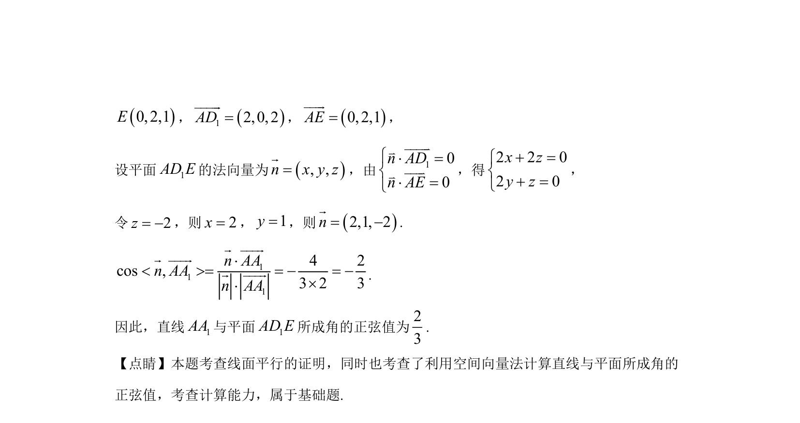

## 题面

## 摘要

证明线面平行并用空间向量法求直线与平面所成角的正弦值

## 关联考点

- [[1088-线面平行判定|线面平行判定]]
- [[399-空间向量坐标表示|空间直角坐标系]]
- [[向量法求线面角]]

## 答案与解析

> 📄 原 PDF 第 12 页：`素材/真题/北京/2008-2024·（北京）数学高考真题/2020年高考数学试卷（北京）（解析卷）.pdf`
