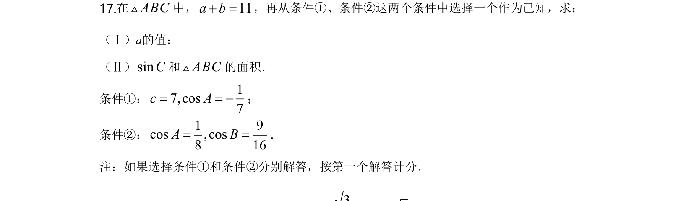
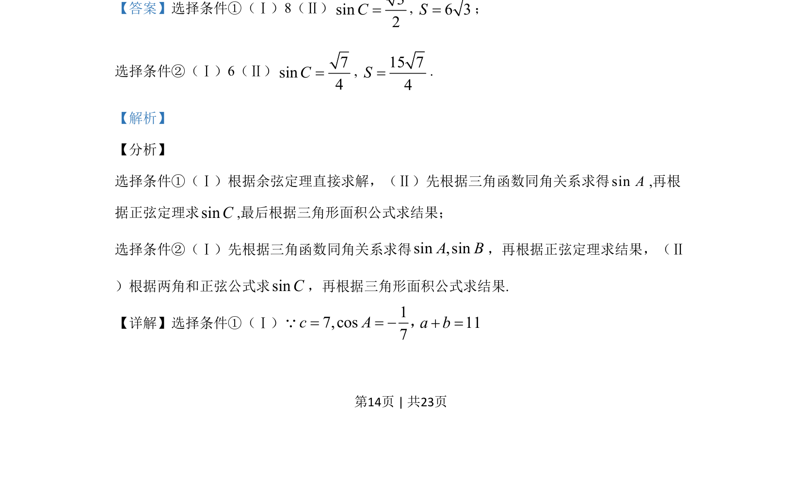
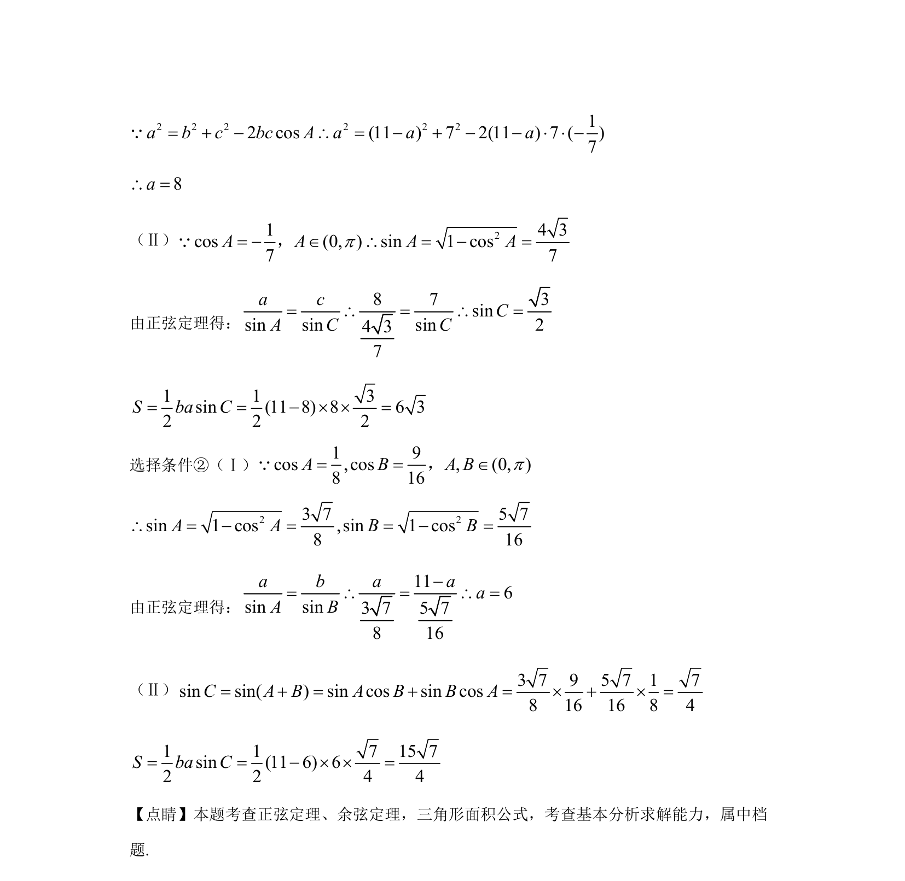

## 题面

## 摘要

本题通过条件选择考查利用余弦定理、正弦定理及同角三角函数关系解三角形并求面积。

## 关联考点

- [[126-定理|余弦定理]]
- [[126-定理|正弦定理]]
- [[619-三角形面积公式|三角形面积公式]]
- [[741-同角三角函数基本关系|同角三角函数基本关系]]

## 答案与解析

> 📄 原 PDF 第 14 页：`素材/真题/北京/2008-2024·（北京）数学高考真题/2020年高考数学试卷（北京）（解析卷）.pdf`
