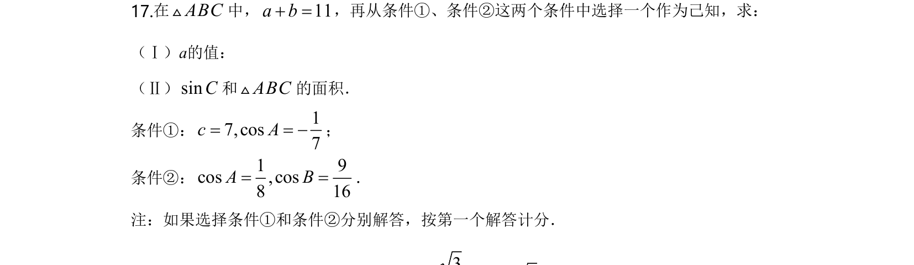
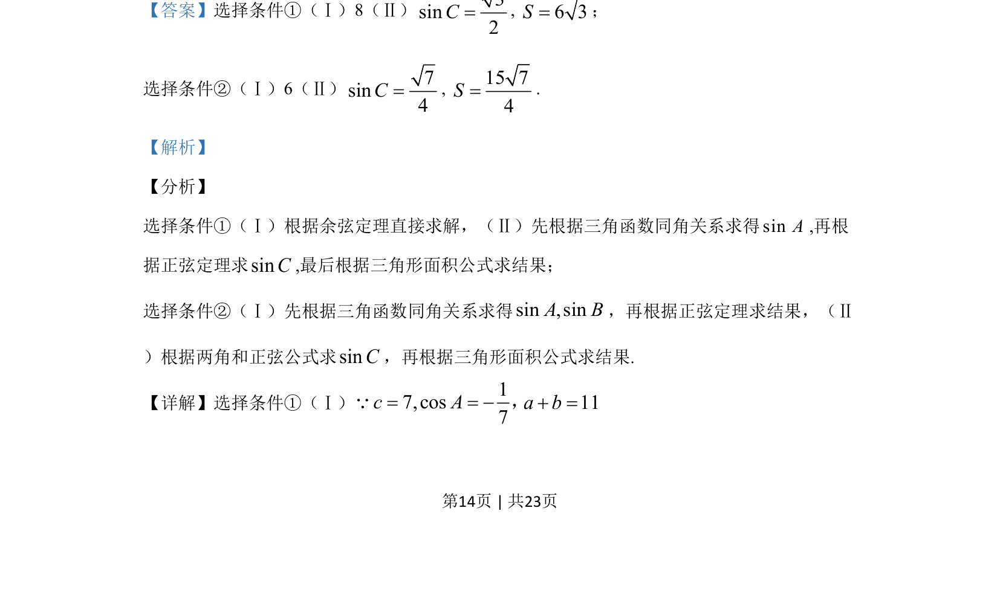
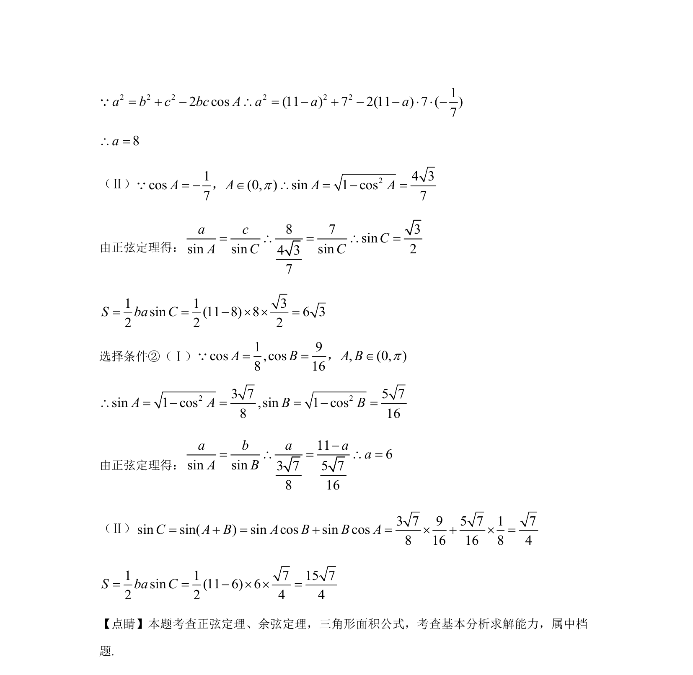

## 题面

## 摘要

本题通过条件选择考查利用余弦定理、正弦定理及同角三角函数关系解三角形并求面积。

## 关联考点

- [[126-定理|余弦定理]]
- [[126-定理|正弦定理]]
- [[619-三角形面积公式|三角形面积公式]]
- [[741-同角三角函数基本关系|同角三角函数基本关系]]

## 答案与解析

> 📄 原 PDF 第 14 页：`素材/真题/北京/2008-2024·（北京）数学高考真题/2020年高考数学试卷（北京）（解析卷）.pdf`

<!-- 题干文本-start -->
## 题干文本
17.在ABCV中，11a b+ =，再从条件①、条件②这两个条件中选择一个作为己知，求：
（Ⅰ）a的值：
（Ⅱ）sinC和ABCV的面积．
条件①： 17,cos7c A= = -；
条件②：1 9cos ,cos8 16A B= =．
注：如果选择条件①和条件②分别解答，按第一个解答计分．
<!-- 题干文本-end -->

<!-- 解析文本-start -->
## 解析文本
【答案】选择条件①（Ⅰ）8（Ⅱ）3sin2C=, 6 3S=；
选择条件②（Ⅰ）6（Ⅱ）7sin4C=, 15 74S=.
【解析】
【分析】
选择条件①（Ⅰ）根据余弦定理直接求解，（Ⅱ）先根据三角函数同角关系求得sinA,再根
据正弦定理求sinC,最后根据三角形面积公式求结果；
选择条件②（Ⅰ）先根据三角函数同角关系求得sin ,sinA B，再根据正弦定理求结果，（Ⅱ
）根据两角和正弦公式求sinC，再根据三角形面积公式求结果.
【详解】选择条件①（Ⅰ） 17,cos7c A= = -Q，11a b+ =
<!-- 解析文本-end -->
