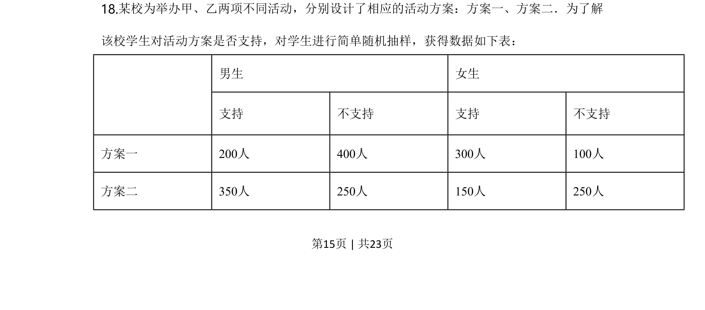
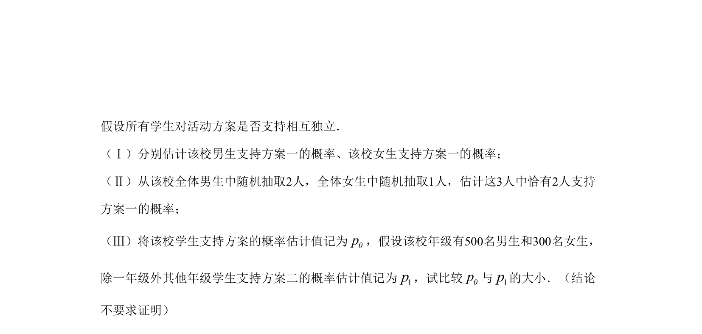
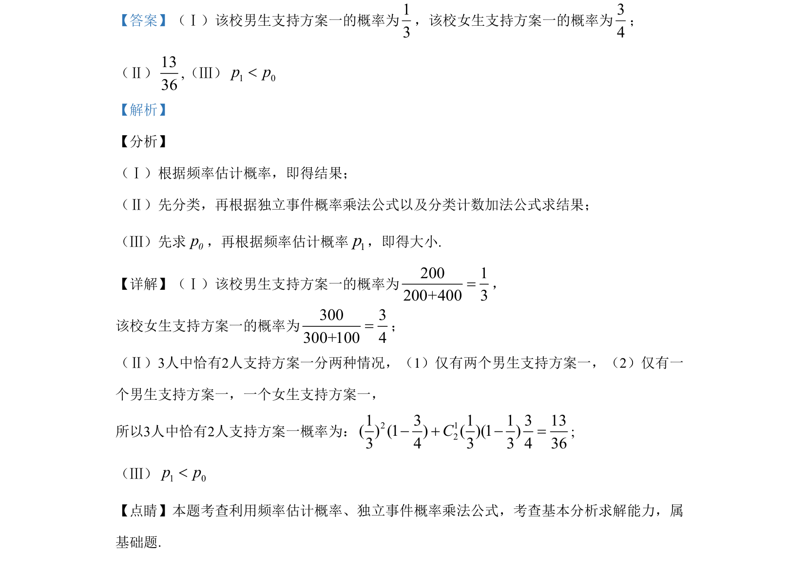

## 题面

## 摘要

该题考查频率估计概率、独立事件概率计算，以及求曲线切线方程与坐标轴围成三角形面积的最值。

## 关联考点

- [[1187-频率估计概率|频率估计概率]]
- [[独立事件概率乘法公式]]
- [[422-切线方程|切线方程]]
- [[1370-利用导数求最值|利用导数求最值]]

## 答案与解析

> 📄 原 PDF 第 15 页：`素材/真题/北京/2008-2024·（北京）数学高考真题/2020年高考数学试卷（北京）（解析卷）.pdf`

<!-- 题干文本-start -->
## 题干文本
18.某校为举办甲、乙两项不同活动，分别设计了相应的活动方案：方案一、方案二．为了解
该校学生对活动方案是否支持，对学生进行简单随机抽样，获得数据如下表：
男生 女生
支持 不支持 支持 不支持
方案一 200人 400人 300人 100人
方案二 350人 250人 150人 250人
<!-- 题干文本-end -->

<!-- 解析文本-start -->
## 解析文本

<!-- 解析文本-end -->
