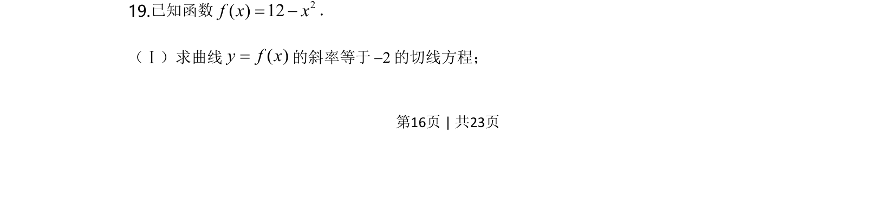
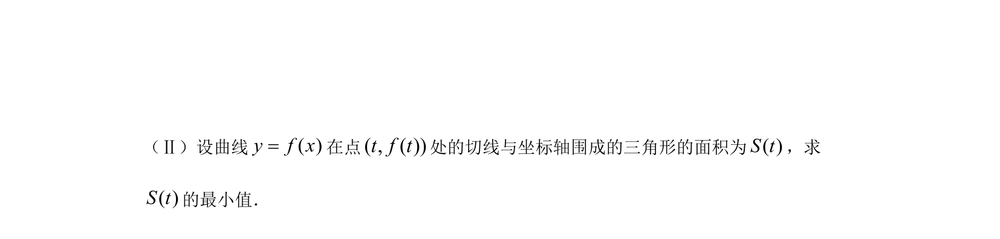
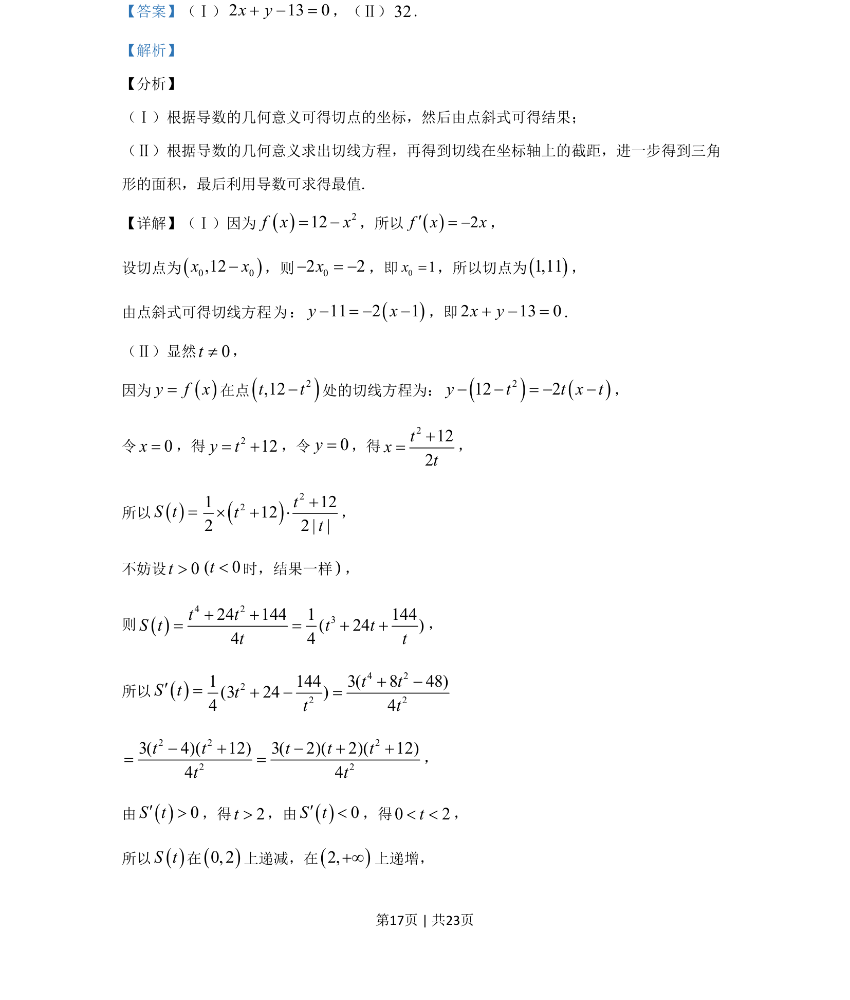
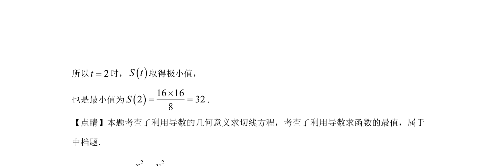

## 题面

## 摘要

本题主要考查利用导数的几何意义求切线方程，并通过截距建立三角形面积函数，再利用导数研究最值。

## 关联考点

- [[440-导数的几何意义|导数的几何意义]]
- [[422-切线方程|切线方程]]
- [[062-多边形面积|三角形面积]]
- [[利用导数求最值]]

## 答案与解析

> 📄 原 PDF 第 16 页：`素材/真题/北京/2008-2024·（北京）数学高考真题/2020年高考数学试卷（北京）（解析卷）.pdf`
