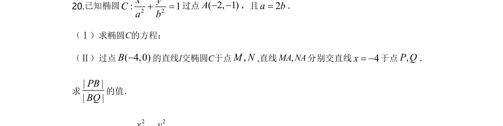
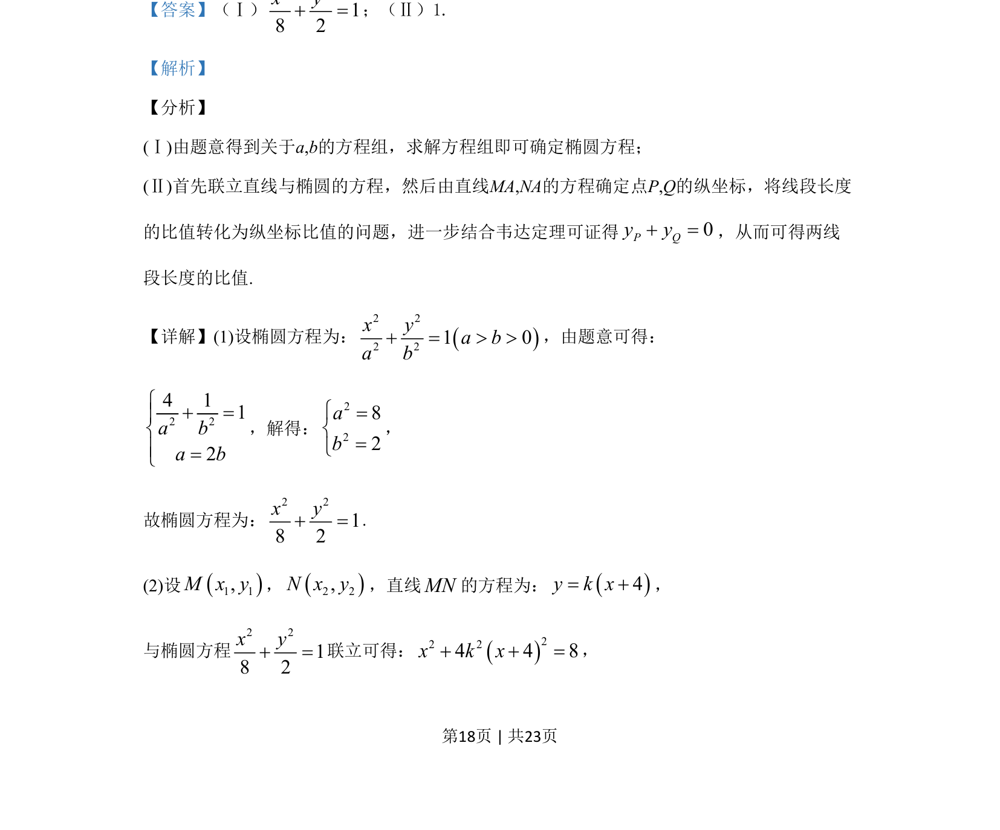
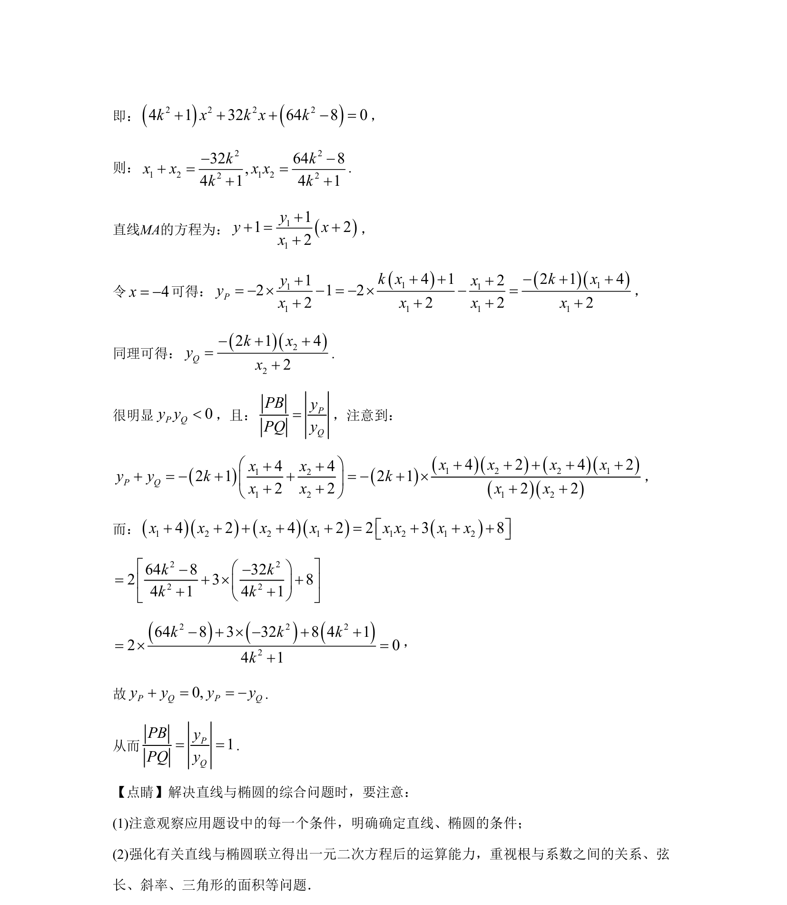

## 题面

## 摘要

根据条件求解椭圆标准方程，并通过联立直线与椭圆方程证明线段长度比值问题。

## 关联考点

- [[061-方程|椭圆的标准方程]]
- [[015-位置|直线与椭圆的位置关系]]
- [[234-韦达定理-初中|韦达定理]]
- [[比值转化]]

## 答案与解析

> 📄 原 PDF 第 18 页：`素材/真题/北京/2008-2024·（北京）数学高考真题/2020年高考数学试卷（北京）（解析卷）.pdf`
