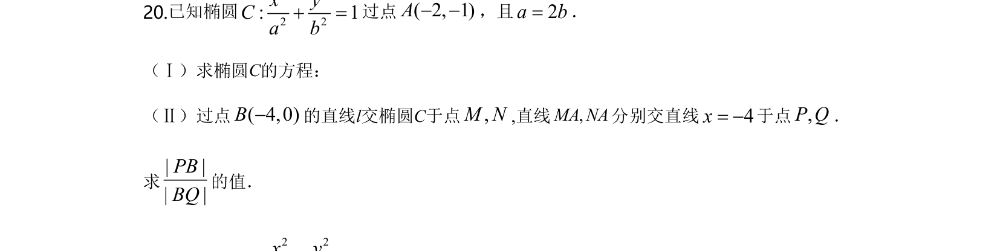
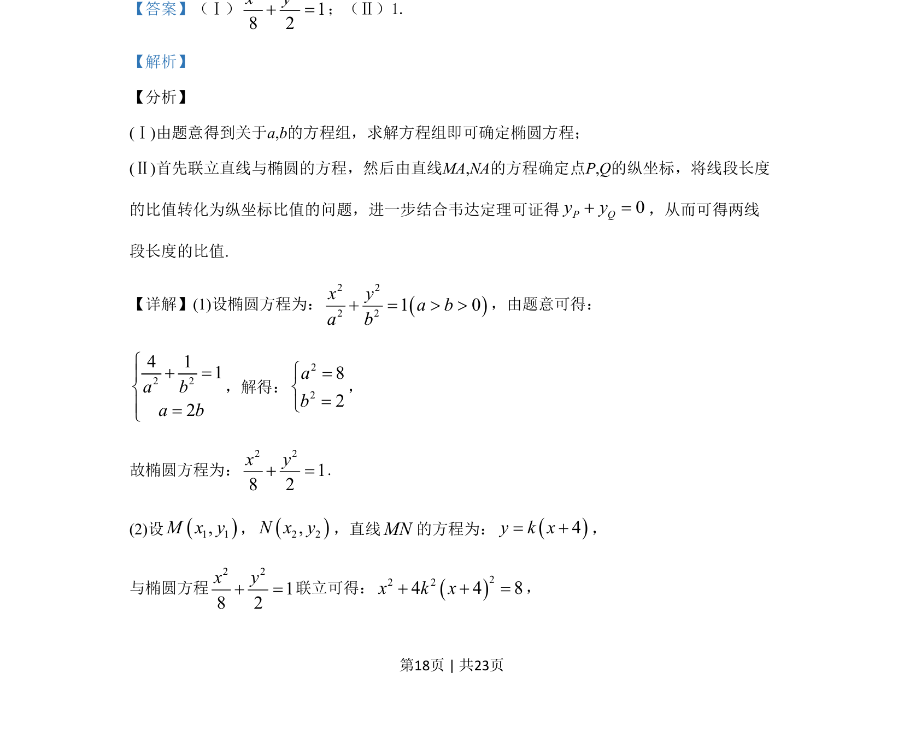
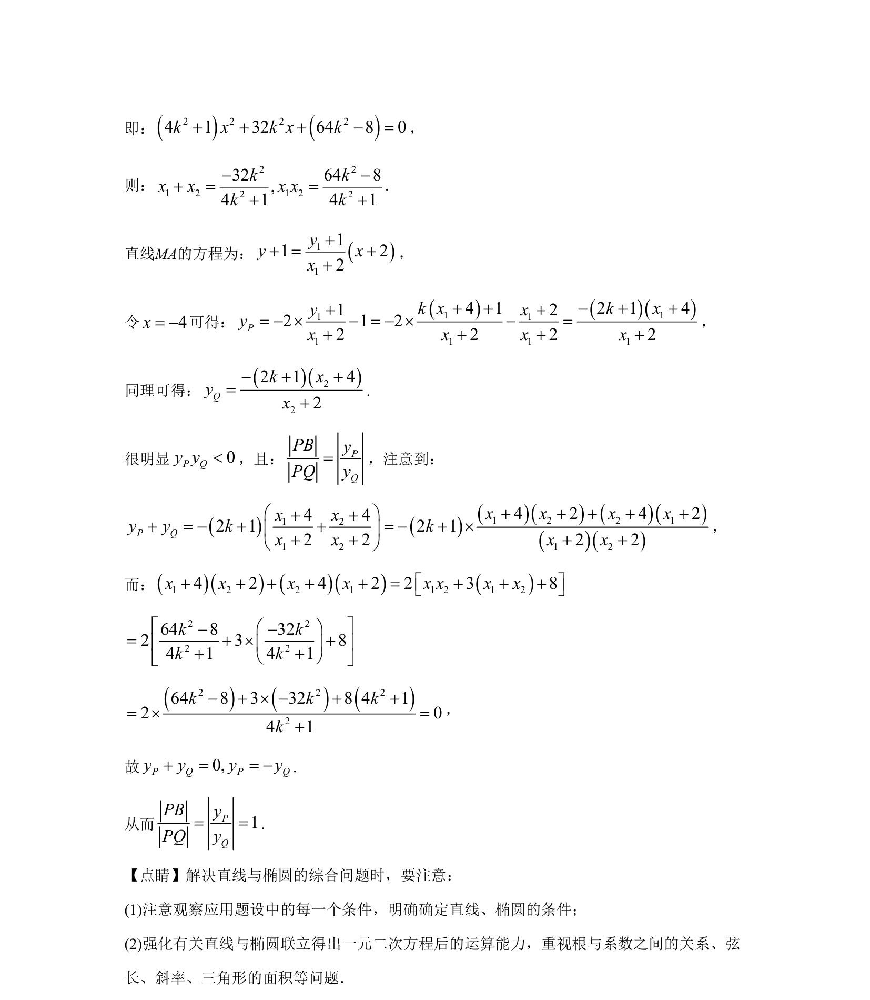

## 题面

## 摘要

根据条件求解椭圆标准方程，并通过联立直线与椭圆方程证明线段长度比值问题。

## 关联考点

- [[061-方程|椭圆的标准方程]]
- [[015-位置|直线与椭圆的位置关系]]
- [[234-韦达定理-初中|韦达定理]]
- [[比值转化]]

## 答案与解析

> 📄 原 PDF 第 18 页：`素材/真题/北京/2008-2024·（北京）数学高考真题/2020年高考数学试卷（北京）（解析卷）.pdf`

<!-- 题干文本-start -->
## 题干文本
20.已知椭圆
2 22 2: 1x yCa b+ =过点( 2, 1)A- -，且2a b=．
（Ⅰ）求椭圆C的方程：
（Ⅱ）过点( 4,0)B-的直线l交椭圆C于点,M N,直线,MA NA分别交直线4x= -于点,P Q．
求
| || |PBBQ的值．
<!-- 题干文本-end -->

<!-- 解析文本-start -->
## 解析文本
【答案】（Ⅰ）
2 218 2x y+ =；（Ⅱ）1.
【解析】
【分析】
(Ⅰ)由题意得到关于a,b的方程组，求解方程组即可确定椭圆方程；
(Ⅱ)首先联立直线与椭圆的方程，然后由直线MA,NA的方程确定点P,Q的纵坐标，将线段长度
的比值转化为纵坐标比值的问题，进一步结合韦达定理可证得 0P Qy y+ =，从而可得两线
段长度的比值.
【详解】(1)设椭圆方程为：()2 22 21 0x ya ba b+ = > >，由题意可得：
2 24 112a ba bì+ =ïíï=î
，解得：
2282abì=í=î
，
故椭圆方程为：
2 218 2x y+ =.
(2)设()1 1,M x y，()2 2,N x y，直线MN的方程为：()4y k x= +，
与椭圆方程
2 218 2x y+ =联立可得：()22 24 4 8x k x+ + =，
<!-- 解析文本-end -->
