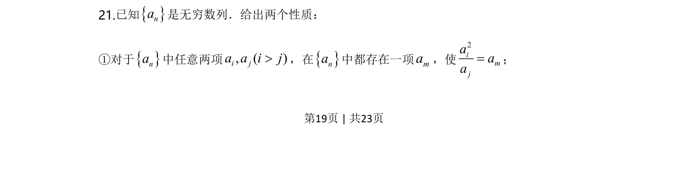
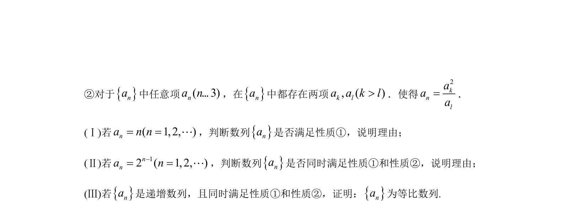
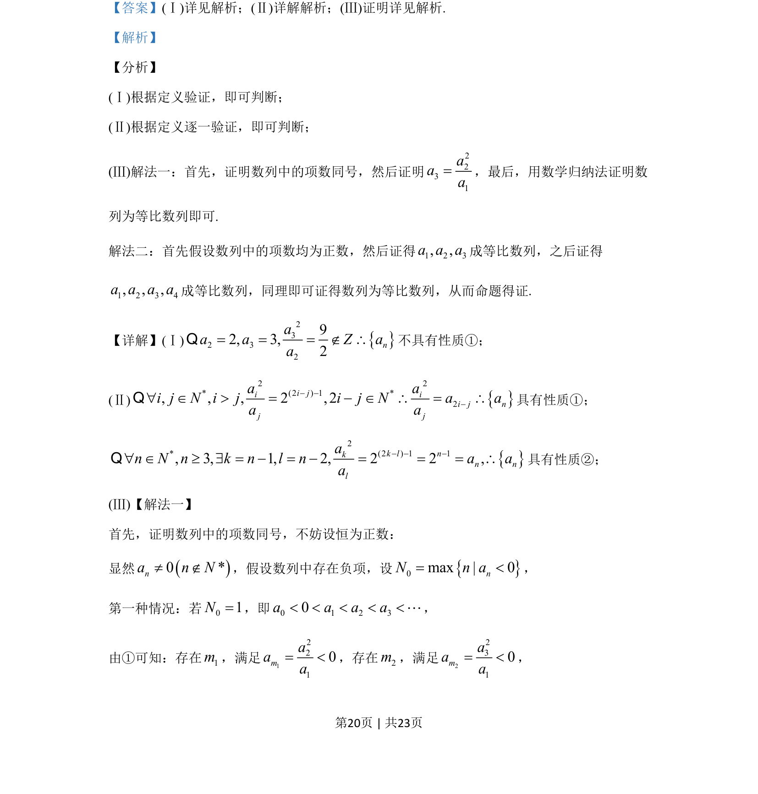
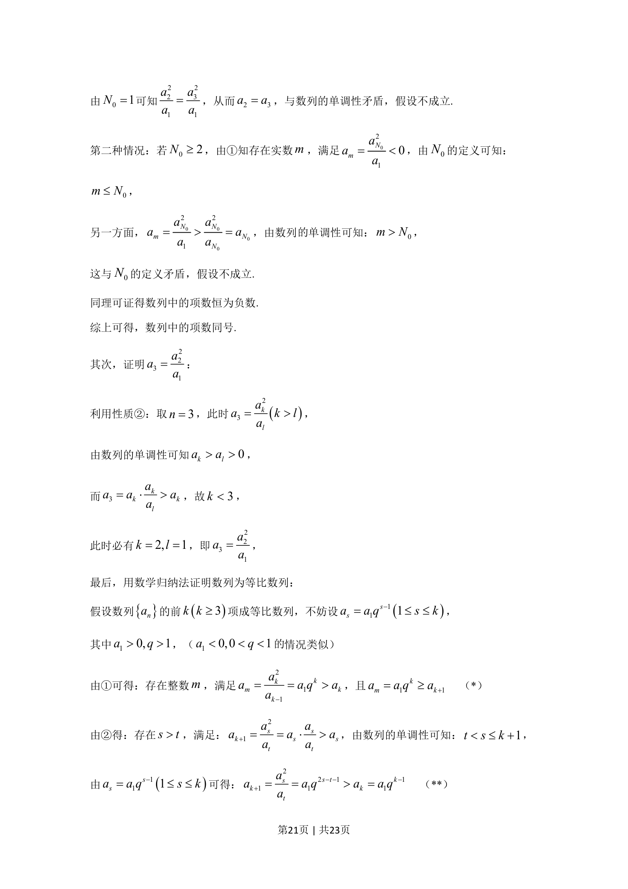
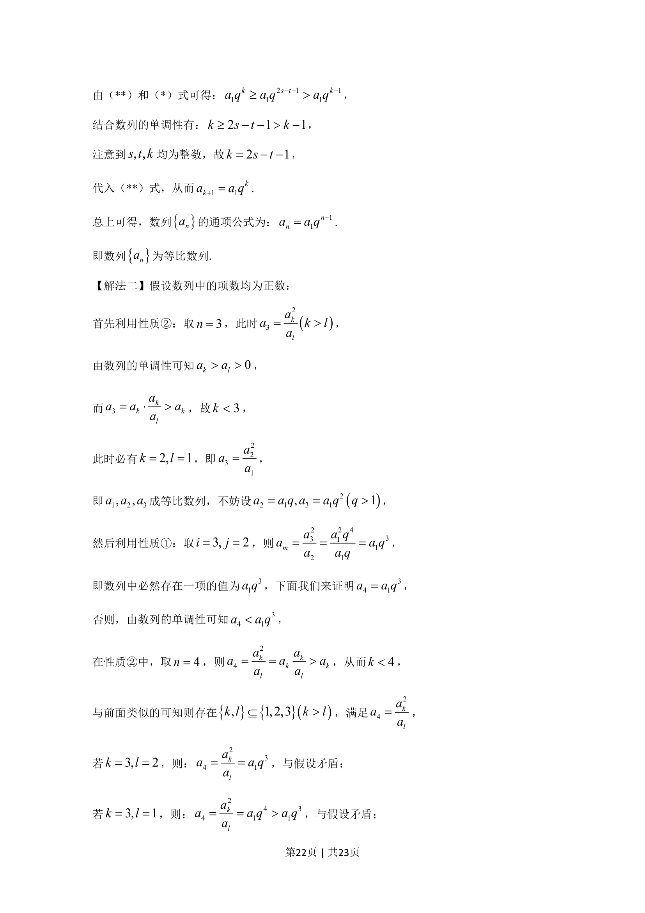
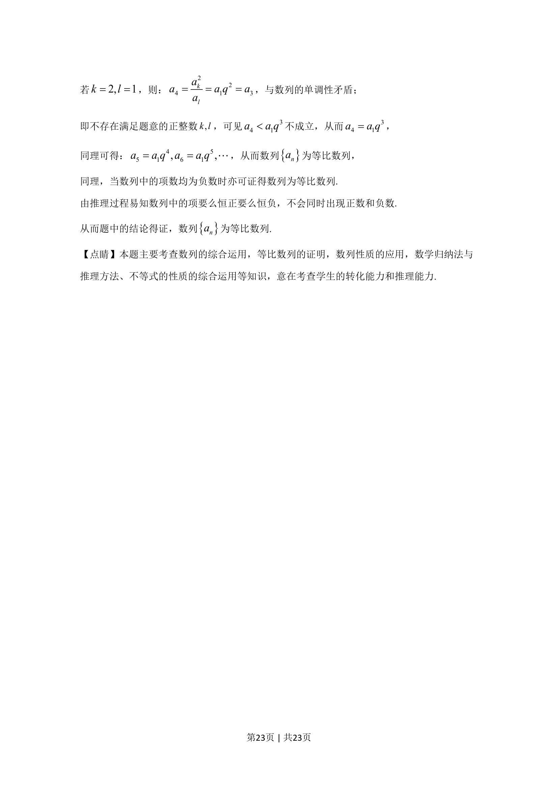

## 题面

## 摘要

考查数列新定义性质验证、等比数列证明及反证法、数学归纳法综合运用。

## 关联考点

- [[数列性质]]
- [[1067-等比数列的定义与通项公式|等比数列]]
- [[1179-反证法|反证法]]
- [[386-数学归纳法-初步|数学归纳法]]

## 答案与解析

> 📄 原 PDF 第 19 页：`素材/真题/北京/2008-2024·（北京）数学高考真题/2020年高考数学试卷（北京）（解析卷）.pdf`
