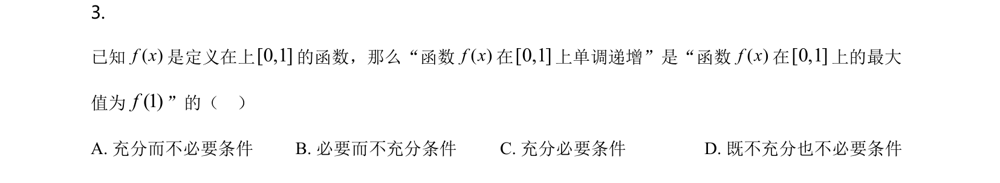
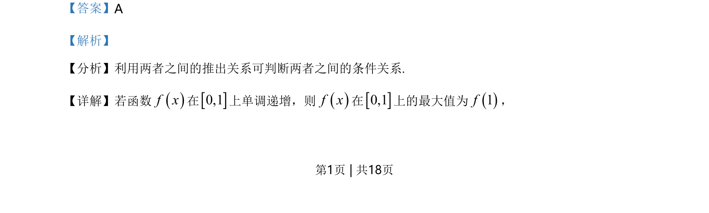
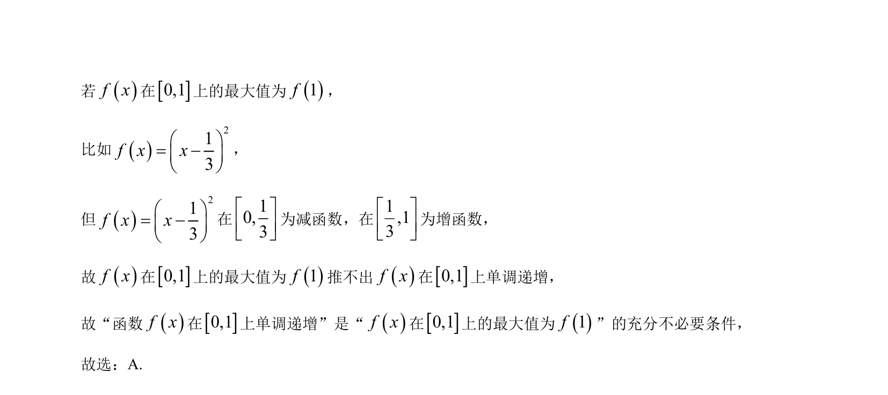

## 题面

## 摘要

判断函数单调性与最大值之间的充分必要条件关系。

## 关联考点

- [[533-充分必要条件|充分必要条件]]
- [[432-导数与函数单调性|函数单调性]]
- [[419-函数最值-高中|函数最值]]

## 答案与解析

> 📄 原 PDF 第 1 页：`素材/真题/北京/2008-2024·（北京）数学高考真题/2021年高考数学试卷（北京）（解析卷）.pdf`
