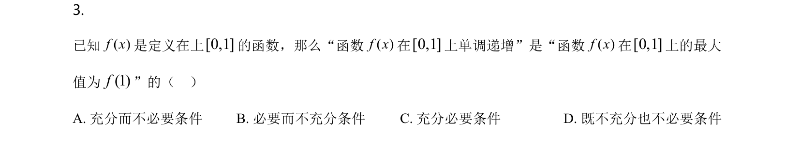
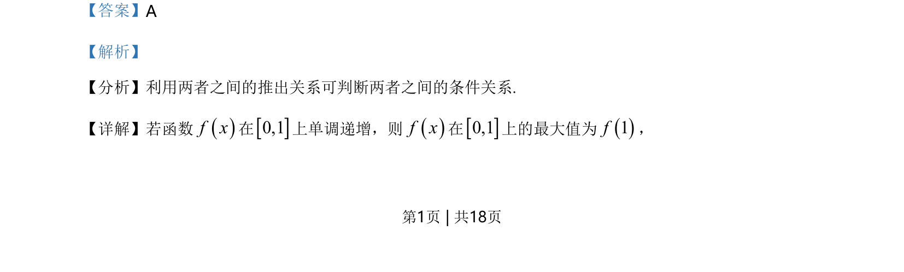
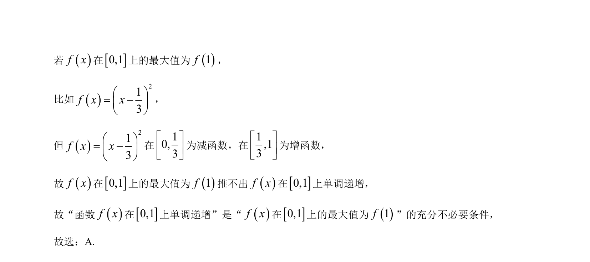

## 题面

## 摘要

判断函数单调性与最大值之间的充分必要条件关系。

## 关联考点

- [[533-充分必要条件|充分必要条件]]
- [[432-导数与函数单调性|函数单调性]]
- [[419-函数最值-高中|函数最值]]

## 答案与解析

> 📄 原 PDF 第 1 页：`素材/真题/北京/2008-2024·（北京）数学高考真题/2021年高考数学试卷（北京）（解析卷）.pdf`

<!-- 题干文本-start -->
## 题干文本
3. 
已知( )f x是定义在上[0,1]的函数，那么“函数( )f x在[0,1]上单调递增”是“函数( )f x在[0,1]上的最大
值为(1)f”的（    ）
A. 充分而不必要条件 B. 必要而不充分条件 C. 充分必要条件 D. 既不充分也不必要条件
<!-- 题干文本-end -->

<!-- 解析文本-start -->
## 解析文本
【答案】A
【解析】
【分析】利用两者之间的推出关系可判断两者之间的条件关系.
【详解】若函数()f x在[]0,1上单调递增，则()f x在[]0,1上的最大值为()1f，
<!-- 解析文本-end -->
