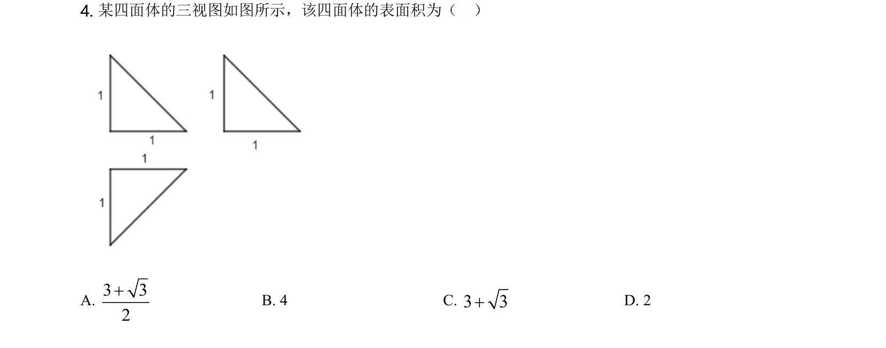
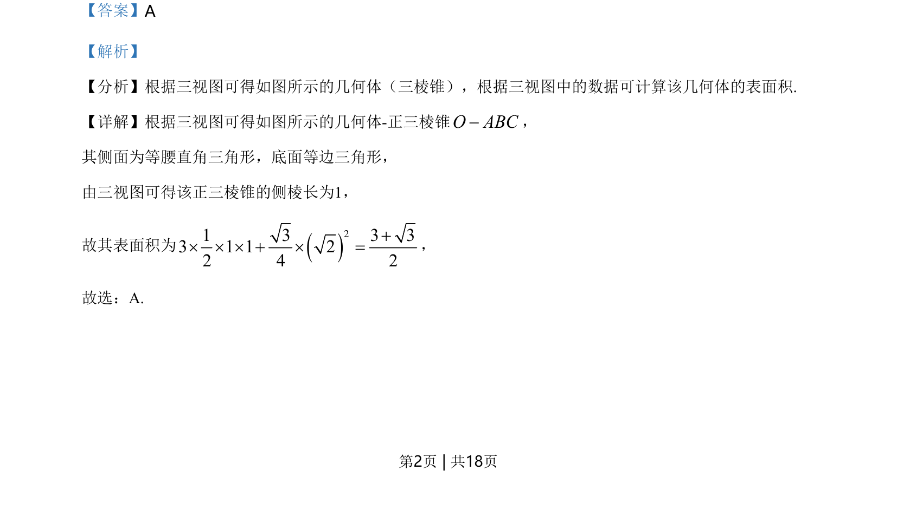
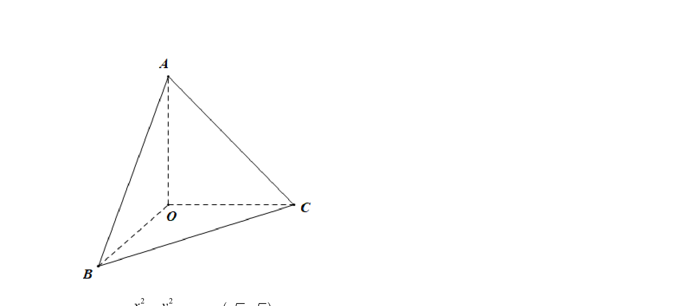

## 题面

## 摘要

根据三视图还原几何体（正三棱锥），并计算其表面积。

## 关联考点

- [[235-三视图|三视图]]
- [[599-三棱锥|三棱锥]]
- [[1336-空间几何体的表面积|几何体表面积]]

## 答案与解析

> 📄 原 PDF 第 2 页：`素材/真题/北京/2008-2024·（北京）数学高考真题/2021年高考数学试卷（北京）（解析卷）.pdf`
