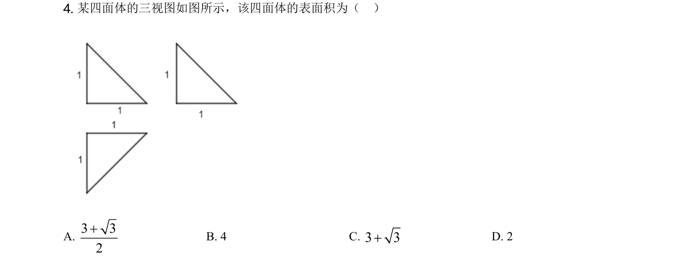
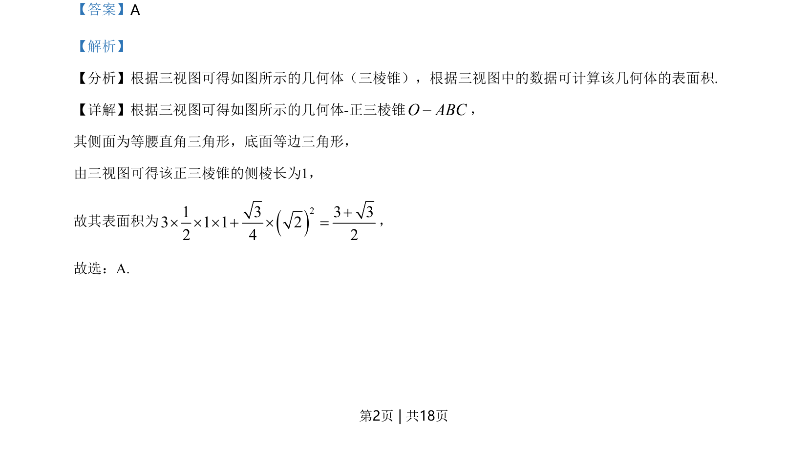
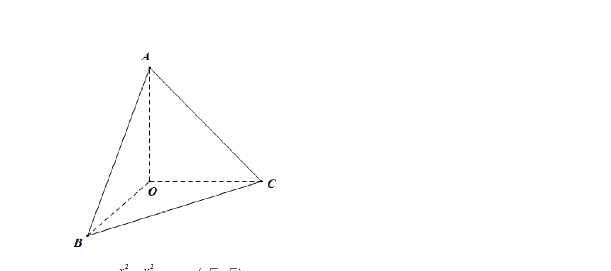

## 题面

## 摘要

根据三视图还原几何体（正三棱锥），并计算其表面积。

## 关联考点

- [[235-三视图|三视图]]
- [[599-三棱锥|三棱锥]]
- [[349-空间几何体表面积|几何体表面积]]

## 答案与解析

> 📄 原 PDF 第 2 页：`素材/真题/北京/2008-2024·（北京）数学高考真题/2021年高考数学试卷（北京）（解析卷）.pdf`

<!-- 题干文本-start -->
## 题干文本
4. 某四面体的三视图如图所示，该四面体的表面积为（    ）
A. 3 32+B. 4 C. 3 3+D. 2
<!-- 题干文本-end -->

<!-- 解析文本-start -->
## 解析文本
【答案】A
【解析】
【分析】根据三视图可得如图所示的几何体（三棱锥），根据三视图中的数据可计算该几何体的表面积.
【详解】根据三视图可得如图所示的几何体-正三棱锥O ABC-，
其侧面为等腰直角三角形，底面等边三角形，
由三视图可得该正三棱锥的侧棱长为1，
故其表面积为 21 3 3 33 1 1 22 4 2+´ ´ ´ + ´ =，
故选：A.
<!-- 解析文本-end -->
