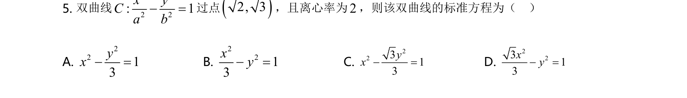
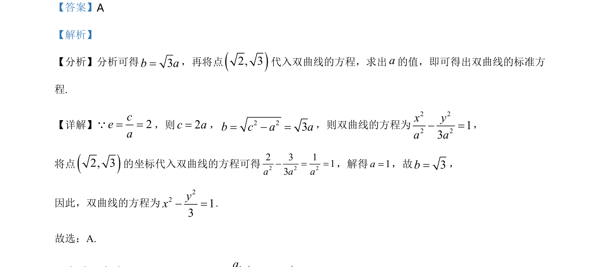

## 题面

## 摘要

该题考查双曲线标准方程的求解，利用离心率和点的坐标确定参数。

## 关联考点

- [[732-双曲线的标准方程|双曲线的标准方程]]
- [[391-椭圆离心率|离心率]]
- [[双曲线中a]]
- [[b]]
- [[c的关系]]

## 答案与解析

> 📄 原 PDF 第 3 页：`素材/真题/北京/2008-2024·（北京）数学高考真题/2021年高考数学试卷（北京）（解析卷）.pdf`
