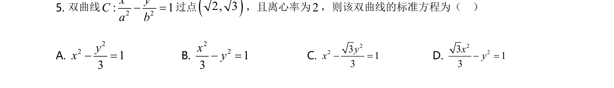
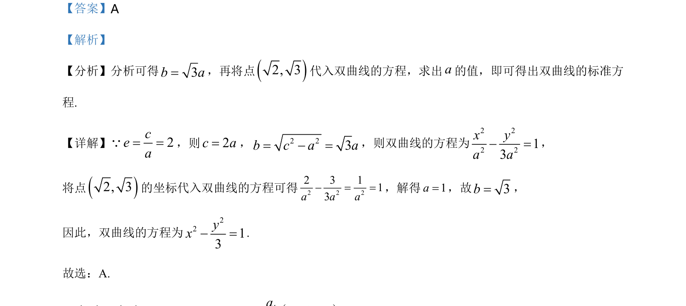

## 题面

## 摘要

该题考查双曲线标准方程的求解，利用离心率和点的坐标确定参数。

## 关联考点

- [[732-双曲线的标准方程|双曲线的标准方程]]
- [[391-椭圆离心率|离心率]]
- [[双曲线中a]]
- [[b]]
- [[c的关系]]

## 答案与解析

> 📄 原 PDF 第 3 页：`素材/真题/北京/2008-2024·（北京）数学高考真题/2021年高考数学试卷（北京）（解析卷）.pdf`

<!-- 题干文本-start -->
## 题干文本
5. 双曲线
2 22 2: 1x yCa b- =过点2, 3，且离心率为2，则该双曲线的标准方程为（    ）
A. 
2213yx- =B. 
2213xy- =C. 
22313yx- =D. 
22313xy- =
<!-- 题干文本-end -->

<!-- 解析文本-start -->
## 解析文本
【答案】A
【解析】
【分析】分析可得3b a=，再将点2, 3代入双曲线的方程，求出a的值，即可得出双曲线的标准方
程.
【详解】 2cea= =Q，则2c a=， 2 23b c a a= - =，则双曲线的方程为
2 22 213x ya a- =，
将点2, 3的坐标代入双曲线的方程可得22223113aaa-==，解得1a=，故3b=，
因此，双曲线的方程为
2213yx- =.
故选：A.
<!-- 解析文本-end -->
