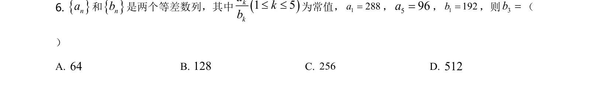
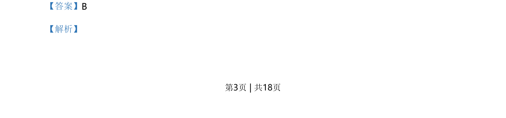
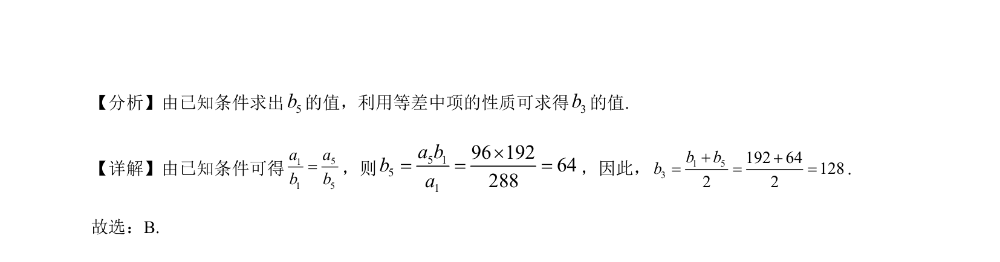

## 题面

## 摘要

判断余弦型函数的奇偶性及利用三角恒等变换求最大值

## 关联考点

- [[284-函数的奇偶性|函数的奇偶性]]
- [[655-余弦的二倍角公式|余弦的二倍角公式]]
- [[1226-二次函数的最值|二次函数的最值]]

## 答案与解析

> 📄 原 PDF 第 3 页：`素材/真题/北京/2008-2024·（北京）数学高考真题/2021年高考数学试卷（北京）（解析卷）.pdf`
