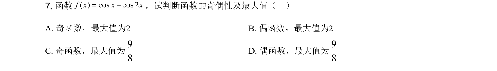
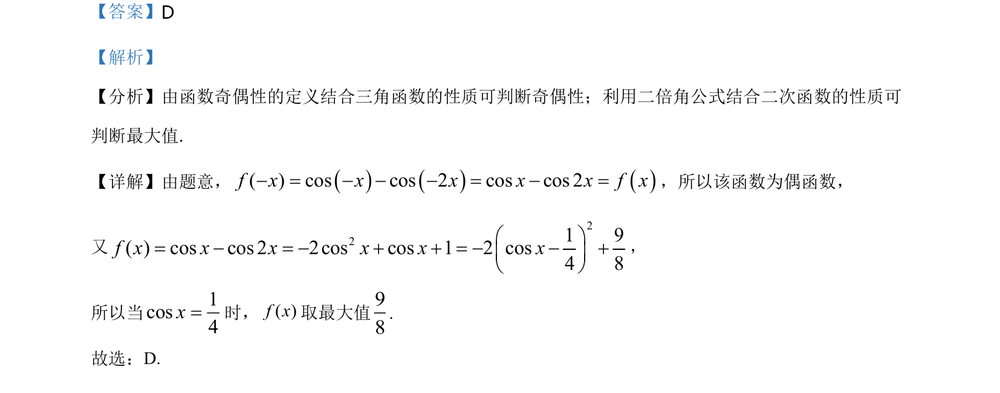

## 题面

## 摘要

该题考查函数奇偶性的判断以及利用二倍角公式和二次函数性质求三角函数的最大值。

## 关联考点

- [[679-函数奇偶性|函数奇偶性]]
- [[637-二倍角公式|二倍角公式]]
- [[211-二次函数图象与性质|二次函数性质]]
- [[607-三角函数最值|三角函数最值]]

## 答案与解析

> 📄 原 PDF 第 4 页：`素材/真题/北京/2008-2024·（北京）数学高考真题/2021年高考数学试卷（北京）（解析卷）.pdf`
