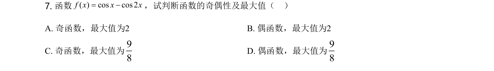
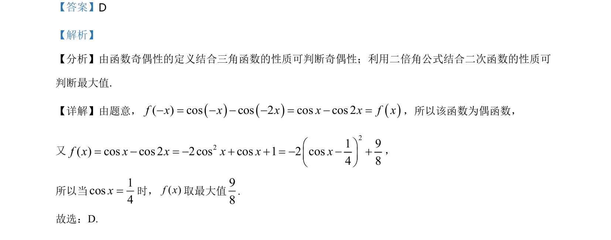

## 题面

## 摘要

该题考查函数奇偶性的判断以及利用二倍角公式和二次函数性质求三角函数的最大值。

## 关联考点

- [[284-函数的奇偶性|函数奇偶性]]
- [[637-二倍角公式|二倍角公式]]
- [[211-二次函数图象与性质|二次函数性质]]
- [[615-三角函数的最值|三角函数最值]]

## 答案与解析

> 📄 原 PDF 第 4 页：`素材/真题/北京/2008-2024·（北京）数学高考真题/2021年高考数学试卷（北京）（解析卷）.pdf`

<!-- 题干文本-start -->
## 题干文本
7. 函数()coscos2fxxx=-，试判断函数的奇偶性及最大值（    ）
A. 奇函数，最大值为2 B. 偶函数，最大值为2
C. 奇函数，最大值为98
D. 偶函数，最大值为98
<!-- 题干文本-end -->

<!-- 解析文本-start -->
## 解析文本
【答案】D
【解析】
【分析】由函数奇偶性的定义结合三角函数的性质可判断奇偶性；利用二倍角公式结合二次函数的性质可
判断最大值.
【详解】由题意，()()()( ) cos cos 2 cos cos 2f x x x x x f x- = - - - = - =，所以该函数为偶函数，
又
221 9( ) cos cos 2 2cos cos 1 2 cos4 8f x x x x x xæ ö= - = - + + = - - +ç ÷è ø
，
所以当1cos4x=时，( )f x取最大值98
.
故选：D.
<!-- 解析文本-end -->
