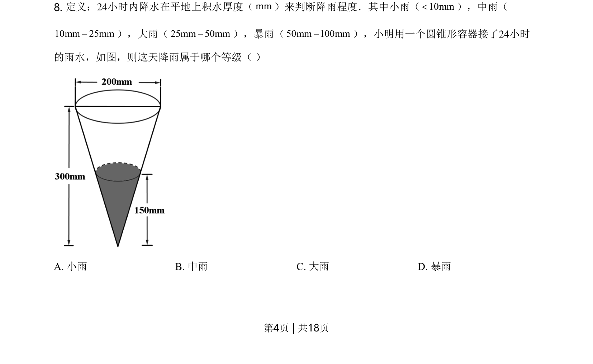
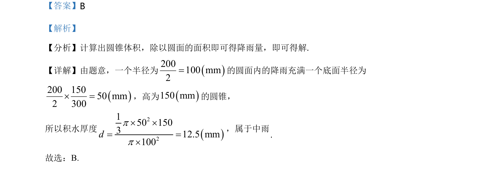

## 题面

## 摘要

通过圆锥体积计算降水厚度，判断雨量等级。

## 关联考点

- [[圆锥体积公式]]
- [[547-单位换算|单位换算]]
- [[实际应用计算]]

## 答案与解析

> 📄 原 PDF 第 4 页：`素材/真题/北京/2008-2024·（北京）数学高考真题/2021年高考数学试卷（北京）（解析卷）.pdf`

<!-- 题干文本-start -->
## 题干文本
8. 定义：24小时内降水在平地上积水厚度（mm）来判断降雨程度．其中小雨（10mm<），中雨（
10mm 25mm-），大雨（25mm 50mm-），暴雨（50mm 100mm-），小明用一个圆锥形容器接了24小时
的雨水，如图，则这天降雨属于哪个等级（ ）
A. 小雨 B. 中雨 C. 大雨 D. 暴雨
<!-- 题干文本-end -->

<!-- 解析文本-start -->
## 解析文本

<!-- 解析文本-end -->
