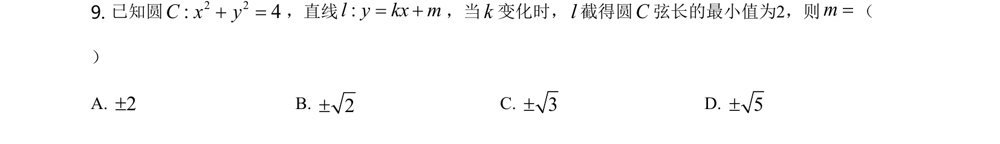
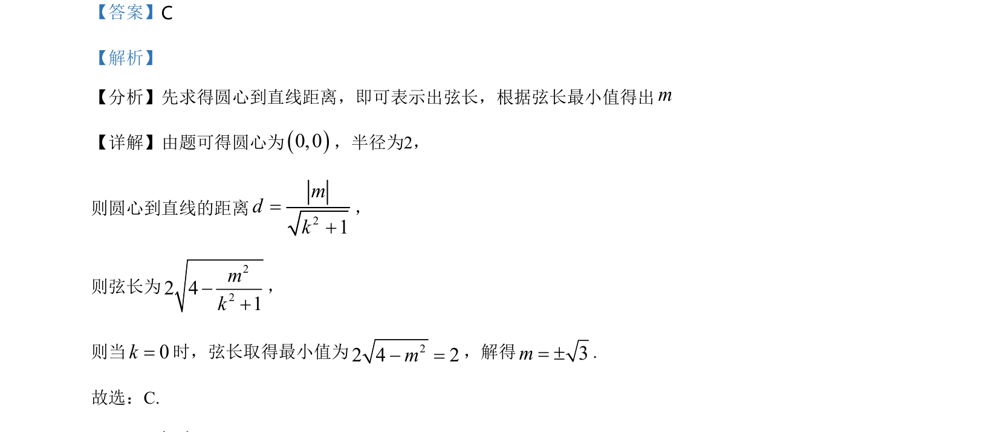

## 题面

## 摘要

圆与直线相交，由弦长最小值求参数 m。

## 关联考点

- [[782-圆的方程|圆的方程]]
- [[1211-点到直线距离|点到直线距离]]
- [[867-弦长公式|弦长公式]]
- [[286-函数的最值|最值]]

## 答案与解析

> 📄 原 PDF 第 5 页：`素材/真题/北京/2008-2024·（北京）数学高考真题/2021年高考数学试卷（北京）（解析卷）.pdf`
