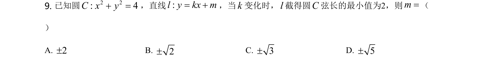
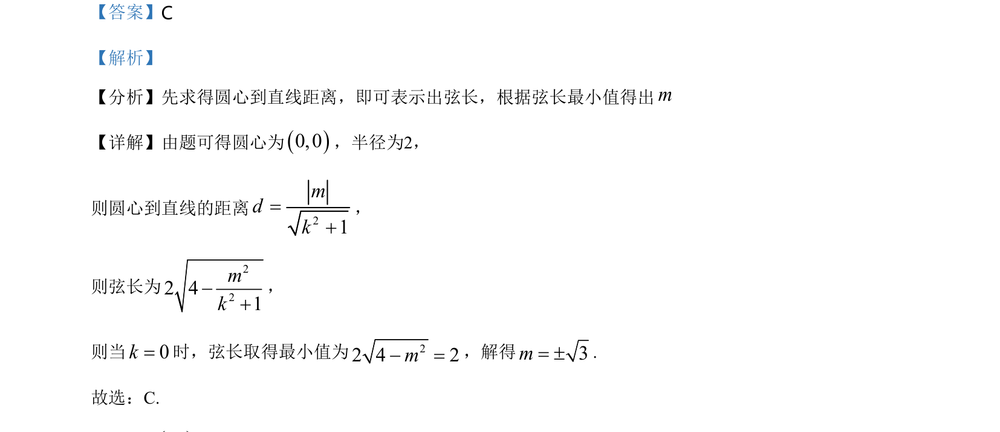

## 题面

## 摘要

圆与直线相交，由弦长最小值求参数 m。

## 关联考点

- [[782-圆的方程|圆的方程]]
- [[1211-点到直线距离|点到直线距离]]
- [[867-弦长公式|弦长公式]]
- [[286-函数的最值|最值]]

## 答案与解析

> 📄 原 PDF 第 5 页：`素材/真题/北京/2008-2024·（北京）数学高考真题/2021年高考数学试卷（北京）（解析卷）.pdf`

<!-- 题干文本-start -->
## 题干文本
9. 已知圆2 2: 4C x y+ =，直线:l y kx m= +，当k变化时，l截得圆C弦长的最小值为2，则m=（    
）
A. 2±B. 2±C. 3±D. 5±
<!-- 题干文本-end -->

<!-- 解析文本-start -->
## 解析文本
【答案】C
【解析】
【分析】先求得圆心到直线距离，即可表示出弦长，根据弦长最小值得出m
【详解】由题可得圆心为()0,0，半径为2，
则圆心到直线的距离 21mdk=+
，
则弦长为
222 41mk-+
，
则当0k=时，弦长取得最小值为 22 4 2m- =，解得3m= ±.
故选：C.
<!-- 解析文本-end -->
