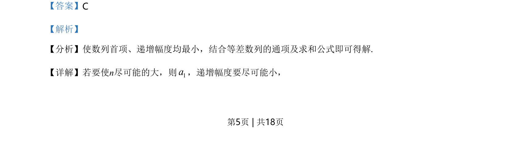
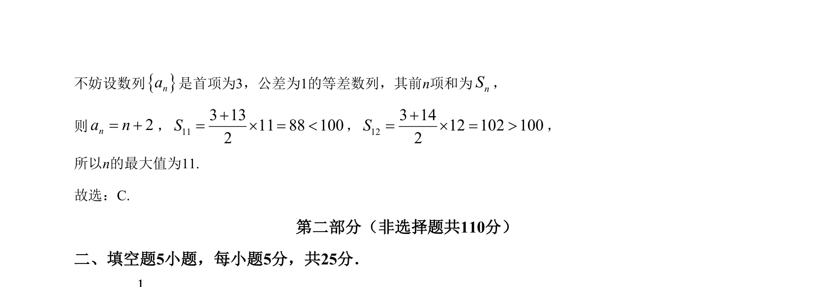

## 题面

## 摘要

已知等差数列首项和公差，求使前n项和小于某值的最大项数n。

## 关联考点

- [[356-等差数列概念|等差数列]]
- [[384-数列通项公式|通项公式]]
- [[355-等差数列前n项和|前n项和]]
- [[623-不等式求解|不等式求解]]

## 答案与解析

> 📄 原 PDF 第 5 页：`素材/真题/北京/2008-2024·（北京）数学高考真题/2021年高考数学试卷（北京）（解析卷）.pdf`
