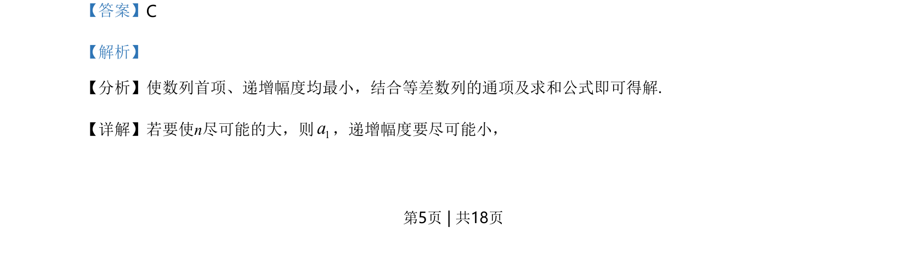
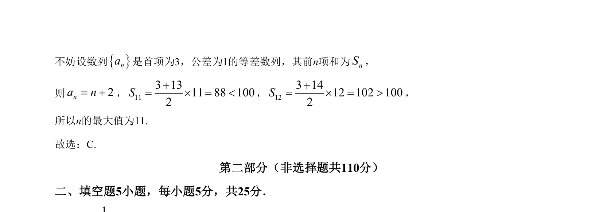

## 题面

## 摘要

已知等差数列首项和公差，求使前n项和小于某值的最大项数n。

## 关联考点

- [[356-等差数列概念|等差数列]]
- [[384-数列通项公式|通项公式]]
- [[355-等差数列前n项和|前n项和]]
- [[623-不等式求解|不等式求解]]

## 答案与解析

> 📄 原 PDF 第 5 页：`素材/真题/北京/2008-2024·（北京）数学高考真题/2021年高考数学试卷（北京）（解析卷）.pdf`

<!-- 题干文本-start -->
## 题干文本
10. 数列na是递增的整数数列，且13a³，12100naaa+++=，则n的最大值为（    ）
A. 9 B. 10 C. 11 D. 12
<!-- 题干文本-end -->

<!-- 解析文本-start -->
## 解析文本
【答案】C
【解析】
【分析】使数列首项、递增幅度均最小，结合等差数列的通项及求和公式即可得解.
【详解】若要使n尽可能的大，则1a，递增幅度要尽可能小，
.
<!-- 解析文本-end -->
