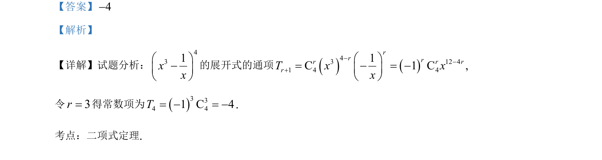

## 题面

## 摘要

考查二项式定理求展开式常数项及抛物线定义与焦点弦三角形面积计算。

## 关联考点

- [[472-二项式定理|二项式定理]]
- [[227-抛物线|抛物线]]
- [[380-抛物线焦点弦|焦点弦]]
- [[062-多边形面积|三角形面积]]

## 答案与解析

> 📄 原 PDF 第 6 页：`素材/真题/北京/2008-2024·（北京）数学高考真题/2021年高考数学试卷（北京）（解析卷）.pdf`

<!-- 题干文本-start -->
## 题干文本
11. 3 41( )xx-展开式中常数项为__________．
<!-- 题干文本-end -->

<!-- 解析文本-start -->
## 解析文本
【答案】4-
【解析】
【详解】试题分析：
431xxæ ö-ç ÷è ø
的展开式的通项()()43 12 41 4 41C 1 C ,rrrr r rrT x xx--+æ ö= - = -ç ÷è ø
 
令3r=得常数项为()334 41 C 4T= - = -.
考点：二项式定理.
<!-- 解析文本-end -->
