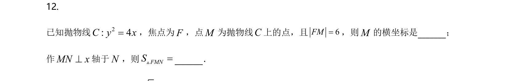
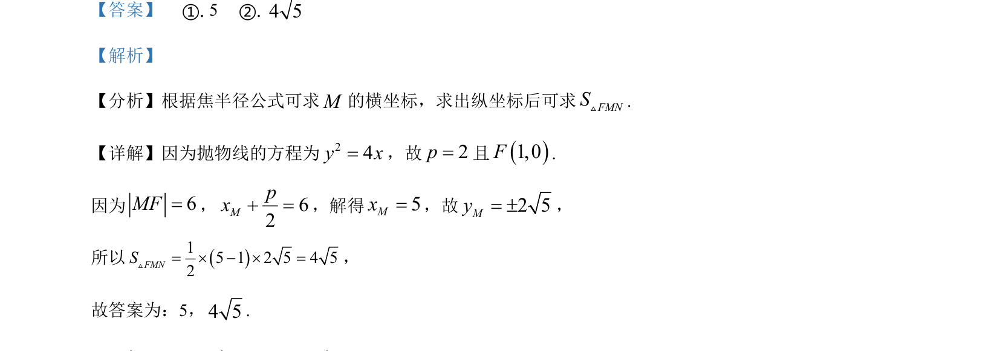

## 题面

## 摘要

该题考查抛物线焦半径公式应用，通过给定长度求点坐标，进而计算三角形面积。

## 关联考点

- [[抛物线的简单几何性质]]
- [[焦半径公式]]
- [[062-多边形面积|三角形面积]]

## 答案与解析

> 📄 原 PDF 第 6 页：`素材/真题/北京/2008-2024·（北京）数学高考真题/2021年高考数学试卷（北京）（解析卷）.pdf`

<!-- 题干文本-start -->
## 题干文本
12. 
已知抛物线2: 4C y x=，焦点为F，点M为抛物线C上的点，且6FM=，则M的横坐标是_______；
作MN x^轴于N，则FMNS=V_______．
<!-- 题干文本-end -->

<!-- 解析文本-start -->
## 解析文本
【答案】    ①. 5    ②. 4 5
【解析】
【分析】根据焦半径公式可求M的横坐标，求出纵坐标后可求FMNSV.
【详解】因为抛物线的方程为24y x=，故2p=且()1,0F.
因为6MF=， 62Mpx+ =，解得5Mx=，故2 5My= ±，
所以()15 1 2 5 4 52FMNS= ´ - ´ =V ，
故答案为：5，4 5.
<!-- 解析文本-end -->
