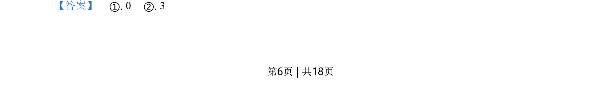
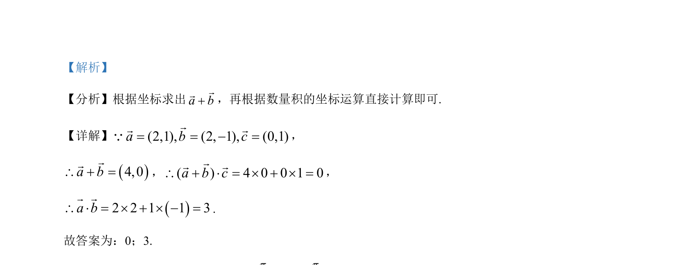

## 题面

## 摘要

该题考查平面向量坐标模长、数量积计算，以及由三角函数点关于y轴对称求角值。

## 关联考点

- [[858-平面向量的坐标运算|平面向量的坐标运算]]
- [[数量积的坐标运算]]
- [[三角函数的对称性]]
- [[1250-三角函数的诱导公式|诱导公式]]

## 答案与解析

> 📄 原 PDF 第 6 页：`素材/真题/北京/2008-2024·（北京）数学高考真题/2021年高考数学试卷（北京）（解析卷）.pdf`
