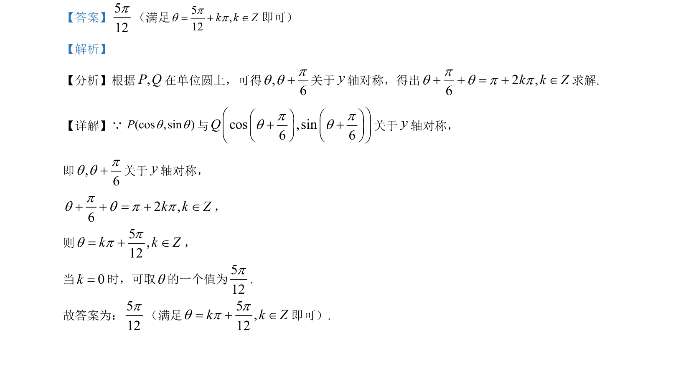

## 题面

## 摘要

给定含参对数函数，讨论参数 k 不同取值时函数零点个数的判断

## 关联考点

- [[288-函数零点|函数零点]]
- [[298-对数函数|对数函数]]
- [[424-参数分类讨论|参数分类讨论]]
- [[函数图像交点]]

## 答案与解析

> 📄 原 PDF 第 7 页：`素材/真题/北京/2008-2024·（北京）数学高考真题/2021年高考数学试卷（北京）（解析卷）.pdf`
