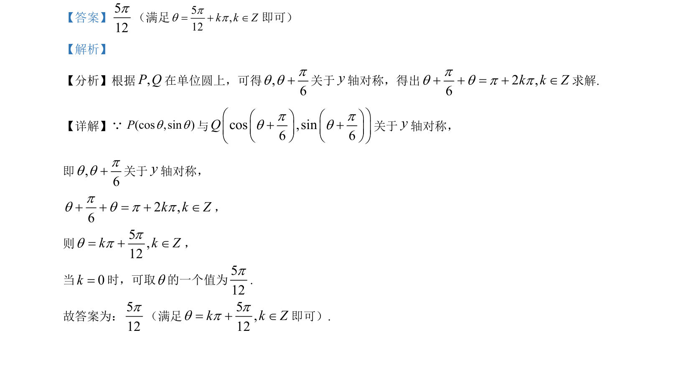

## 题面

## 摘要

给定含参对数函数，讨论参数 k 不同取值时函数零点个数的判断

## 关联考点

- [[288-函数零点|函数零点]]
- [[298-对数函数|对数函数]]
- [[424-参数分类讨论|参数分类讨论]]
- [[函数图像交点]]

## 答案与解析

> 📄 原 PDF 第 7 页：`素材/真题/北京/2008-2024·（北京）数学高考真题/2021年高考数学试卷（北京）（解析卷）.pdf`

<!-- 题干文本-start -->
## 题干文本
14. 若点(cos ,sin )Pq q与点(cos(),sin())66Qppqq++关于y轴对称，写出一个符合题意的q=___．
<!-- 题干文本-end -->

<!-- 解析文本-start -->
## 解析文本
【答案】512p（满足5,12kkZpqp=+∈即可）
【解析】
【分析】根据,P Q在单位圆上，可得,6pq q+关于y轴对称，得出 2 ,6k k Zpq q p p+ + = + ∈求解.
【详解】Q(cos ,sin )Pq q与cos ,sin6 6Qp pq qæ öæ ö æ ö+ +ç ÷ ç ÷ç ÷è ø è øè ø
关于y轴对称，
即,6pq q+关于y轴对称， 
2 ,6k k Zpq q p p+ + = + ∈，
则5,12k k Zpq p= + ∈，
当0k=时，可取q的一个值为512p.
故答案为：512p（满足5,12k k Zpq p= + ∈即可）.
<!-- 解析文本-end -->
