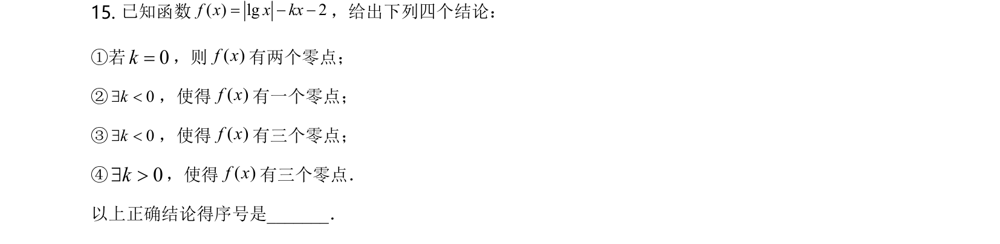
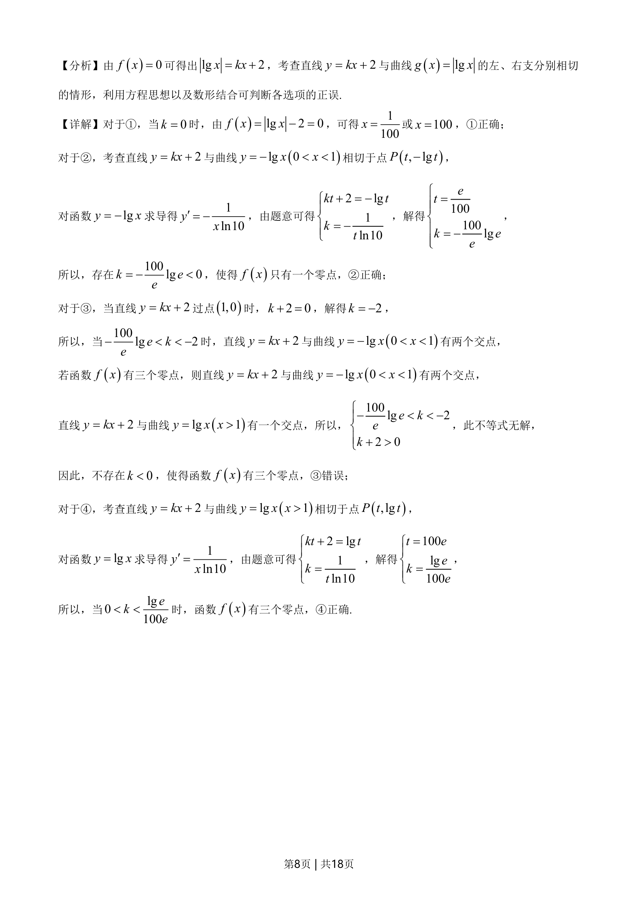
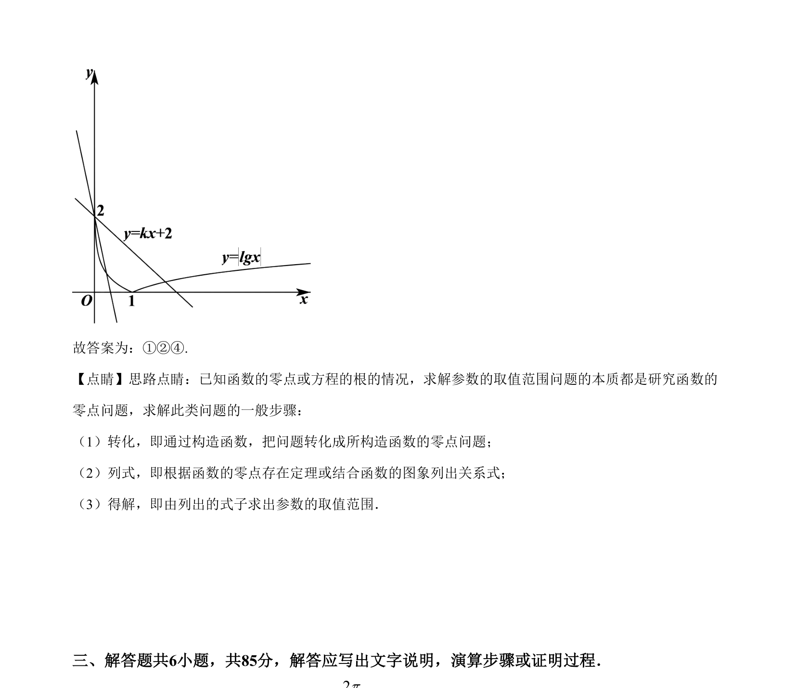

## 题面

## 摘要

考查含参对数函数的零点个数，通过直线与对数曲线相切及交点分析参数范围。

## 关联考点

- [[288-函数零点|函数零点]]
- [[897-数形结合|数形结合]]
- [[298-对数函数|对数函数]]
- [[726-参数范围|参数范围]]

## 答案与解析

> 📄 原 PDF 第 7 页：`素材/真题/北京/2008-2024·（北京）数学高考真题/2021年高考数学试卷（北京）（解析卷）.pdf`
