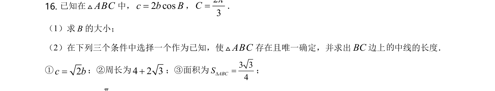
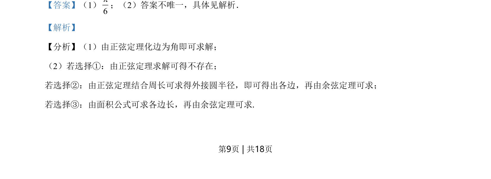
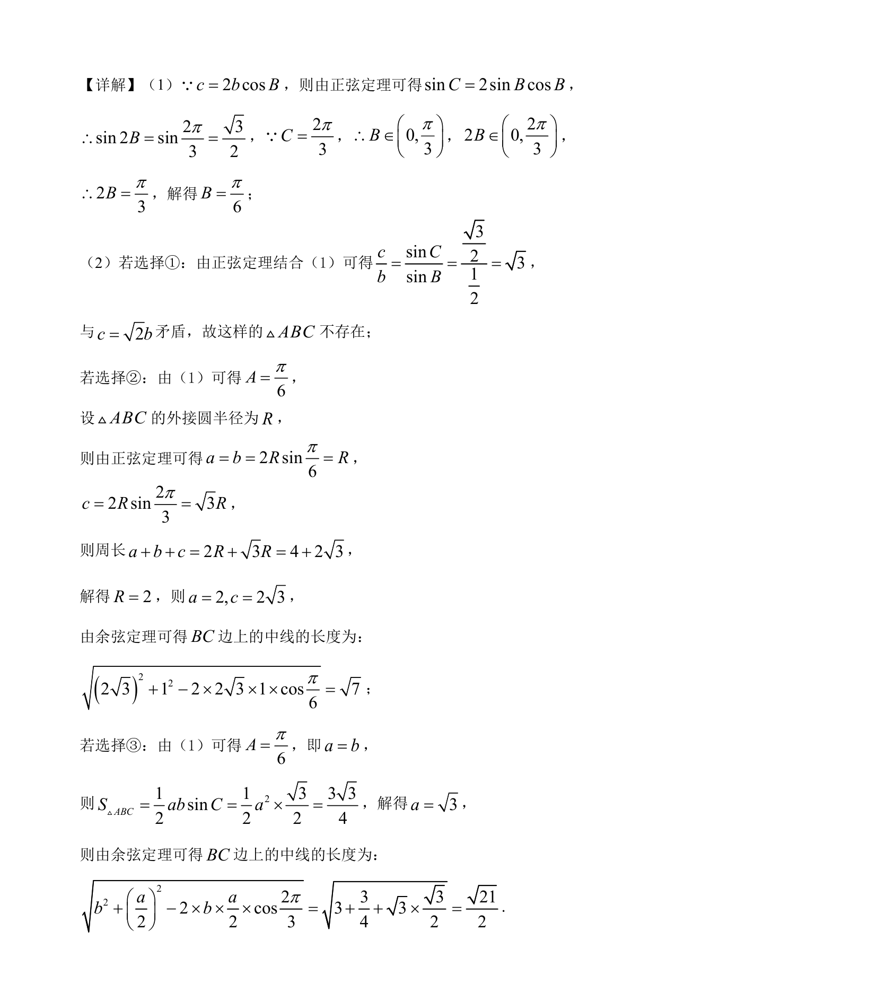

## 题面

## 摘要

该题考查利用正弦定理和余弦定理解三角形，包含三角形存在性判断及条件选择下的边角计算。

## 关联考点

- [[126-定理|正弦定理]]
- [[126-定理|余弦定理]]
- [[589-解三角形|解三角形]]
- [[619-三角形面积公式|三角形面积公式]]

## 答案与解析

> 📄 原 PDF 第 9 页：`素材/真题/北京/2008-2024·（北京）数学高考真题/2021年高考数学试卷（北京）（解析卷）.pdf`
