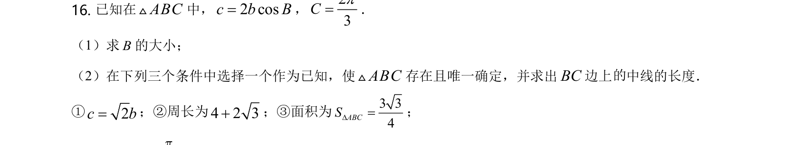
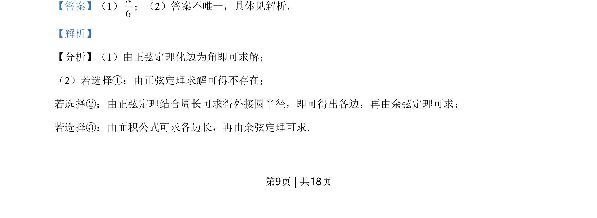
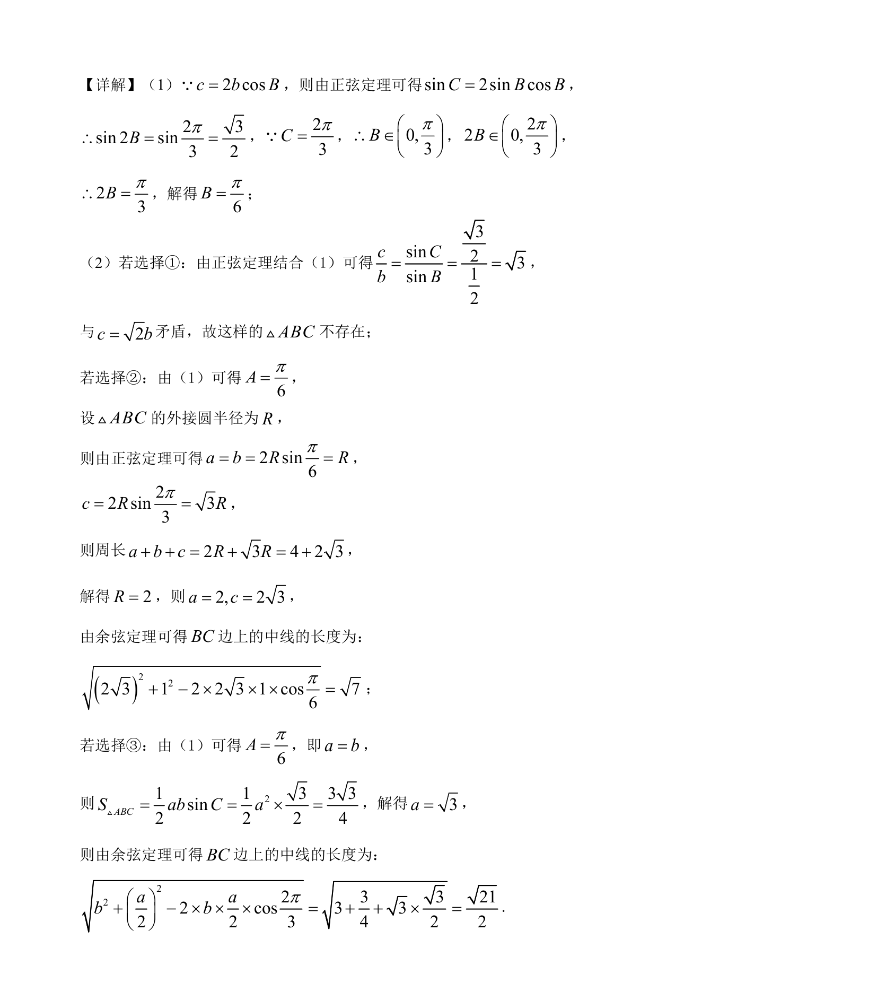

## 题面

## 摘要

该题考查利用正弦定理和余弦定理解三角形，包含三角形存在性判断及条件选择下的边角计算。

## 关联考点

- [[126-定理|正弦定理]]
- [[126-定理|余弦定理]]
- [[589-解三角形|解三角形]]
- [[619-三角形面积公式|三角形面积公式]]

## 答案与解析

> 📄 原 PDF 第 9 页：`素材/真题/北京/2008-2024·（北京）数学高考真题/2021年高考数学试卷（北京）（解析卷）.pdf`

<!-- 题干文本-start -->
## 题干文本
16. 已知在ABCV中，2 cosc b B=，23Cp=．
（1）求B的大小；
（2）在下列三个条件中选择一个作为已知，使ABCV存在且唯一确定，并求出BC边上 中线的长度．
①2c b=；②周长为4 2 3+；③面积为3 34ABCSD=；
<!-- 题干文本-end -->

<!-- 解析文本-start -->
## 解析文本
【答案】（1）6p；（2）答案不唯一，具体见解析．
【解析】
【分析】（1）由正弦定理化边为角即可求解；
（2）若选择①：由正弦定理求解可得不存在；
若选择②：由正弦定理结合周长可求得外接圆半径，即可得出各边，再由余弦定理可求；
若选择③：由面积公式可求各边长，再由余弦定理可求.
的
<!-- 解析文本-end -->
