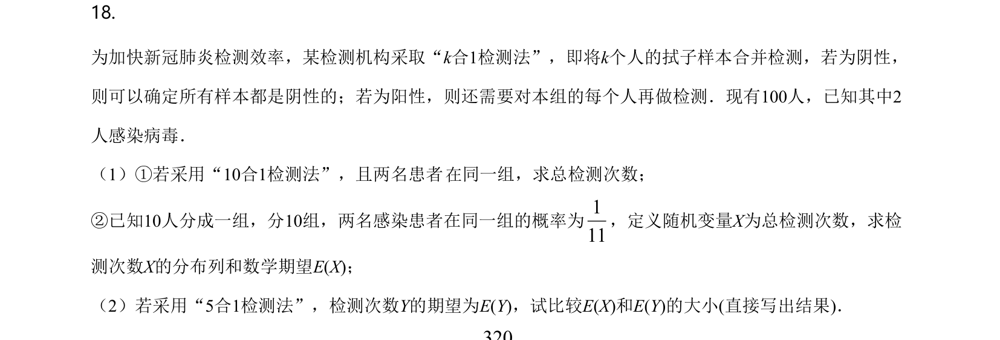
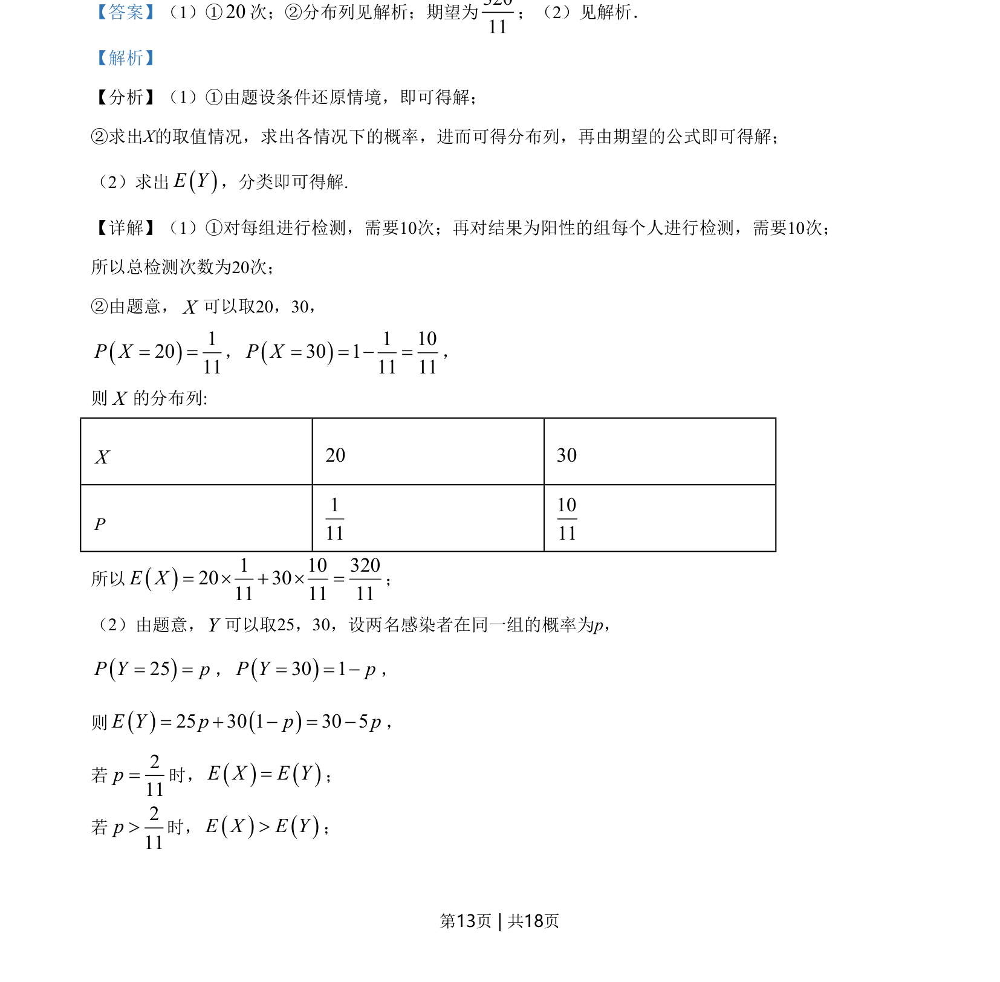
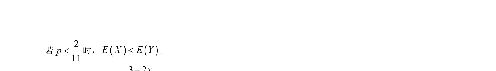

## 题面

## 摘要

考查混合分组检测的概率分布与期望比较，以及含参函数切线、极值、单调区间与最值的求解。

## 关联考点

- [[离散型随机变量的分布列]]
- [[1040-离散型随机变量的期望|数学期望]]
- [[440-导数的几何意义|导数的几何意义]]
- [[利用导数研究函数的单调性与极值最值]]

## 答案与解析

> 📄 原 PDF 第 13 页：`素材/真题/北京/2008-2024·（北京）数学高考真题/2021年高考数学试卷（北京）（解析卷）.pdf`
