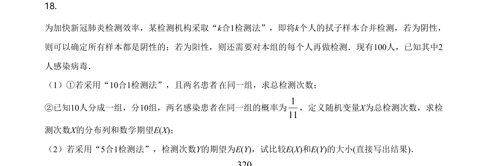
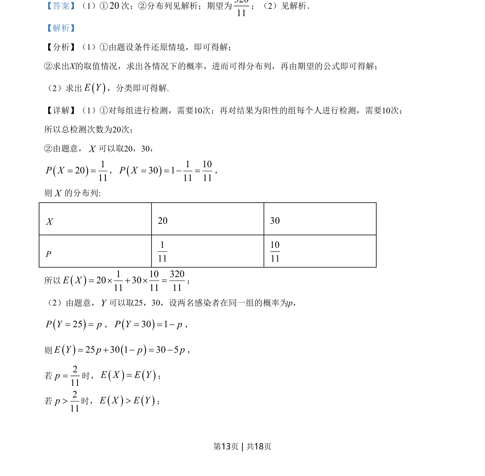

## 题面

## 摘要

考查混合分组检测的概率分布与期望比较，以及含参函数切线、极值、单调区间与最值的求解。

## 关联考点

- [[离散型随机变量的分布列]]
- [[501-离散型随机变量期望|数学期望]]
- [[440-导数的几何意义|导数的几何意义]]
- [[利用导数研究函数的单调性与极值最值]]

## 答案与解析

> 📄 原 PDF 第 13 页：`素材/真题/北京/2008-2024·（北京）数学高考真题/2021年高考数学试卷（北京）（解析卷）.pdf`

<!-- 题干文本-start -->
## 题干文本
18. 
为加快新冠肺炎检测效率，某检测机构采取“k合1检测法”，即将k个人的拭子样本合并检测，若为阴性，
则可以确定所有样本都是阴性的；若为阳性，则还需要对本组的每个人再做检测．现有100人，已知其中2
人感染病毒．
（1）①若采用“10合1检测法”，且两名患者 同一组，求总检测次数；
②已知10人分成一组，分10组，两名感染患者在同一组的概率为111
，定义随机变量X为总检测次数，求检
测次数X的分布列和数学期望E(X)；
（2）若采用“5合1检测法”，检测次数Y的期望为E(Y)，试比较E(X)和E(Y)的大小(直接写出结果)．
<!-- 题干文本-end -->

<!-- 解析文本-start -->
## 解析文本
【答案】（1）①20次；②分布列见解析；期望为32011
；（2）见解析．
【解析】
【分析】（1）①由题设条件还原情境，即可得解；
②求出X的取值情况，求出各情况下的概率，进而可得分布列，再由期望的公式即可得解；
（2）求出E Y，分类即可得解.
【详解】（1）①对每组进行检测，需要10次；再对结果为阳性的组每个人进行检测，需要10次；
所以总检测次数为20次；
②由题意，X可以取20，30，
12011P X= =，1 1030 111 11P X= = - =，
则X的分布列:
X2030P1111011
所以1 10 32020 3011 11 11E X= ´ + ´ =；
（2）由题意，Y可以取25，30，设两名感染者在同一组的概率为p，
25P Y p= =，30 1P Y p= = -，
则25 30 1 30 5E Y p p p= + - = -，
若211p=时，E X E Y=；
若211p>时，E X E Y>；
在
<!-- 解析文本-end -->
