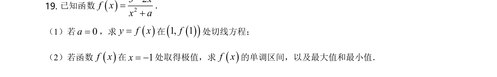
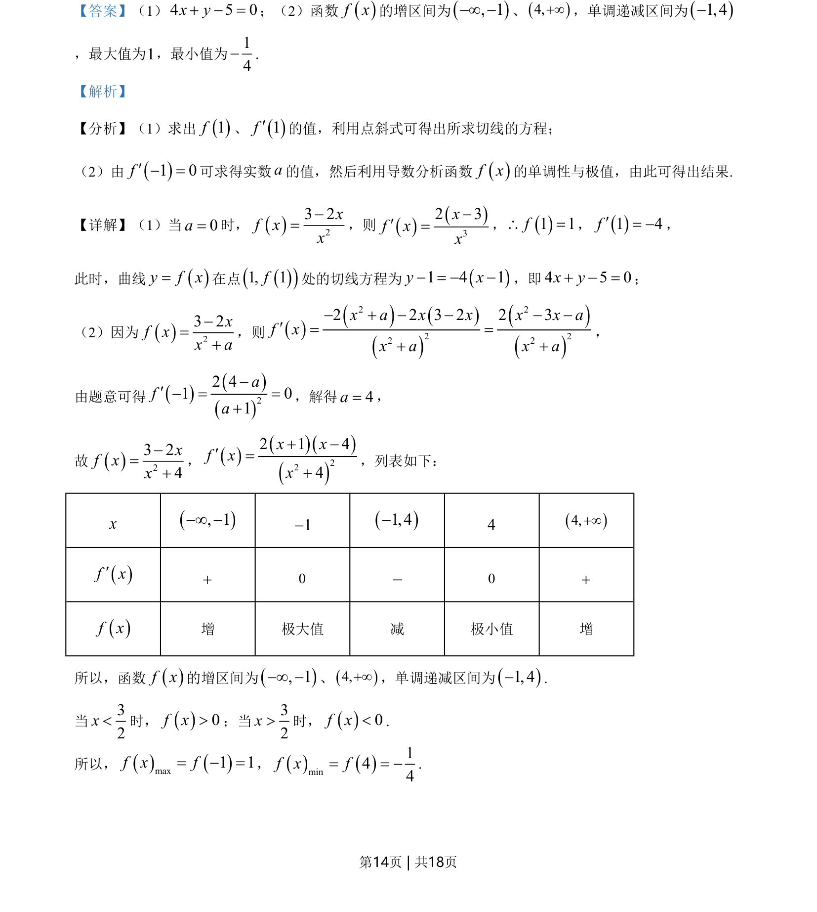

## 题面

## 摘要

考查导数几何意义求切线及利用导数求含参函数单调区间与极值

## 关联考点

- [[440-导数的几何意义|导数的几何意义]]
- [[705-利用导数研究函数的单调性|利用导数研究函数的单调性]]
- [[707-利用导数研究函数的极值|利用导数研究函数的极值]]

## 答案与解析

> 📄 原 PDF 第 14 页：`素材/真题/北京/2008-2024·（北京）数学高考真题/2021年高考数学试卷（北京）（解析卷）.pdf`
