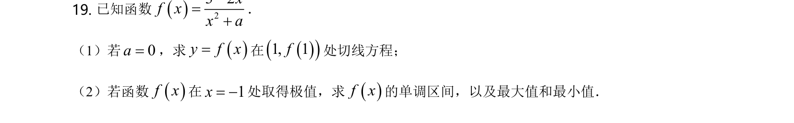
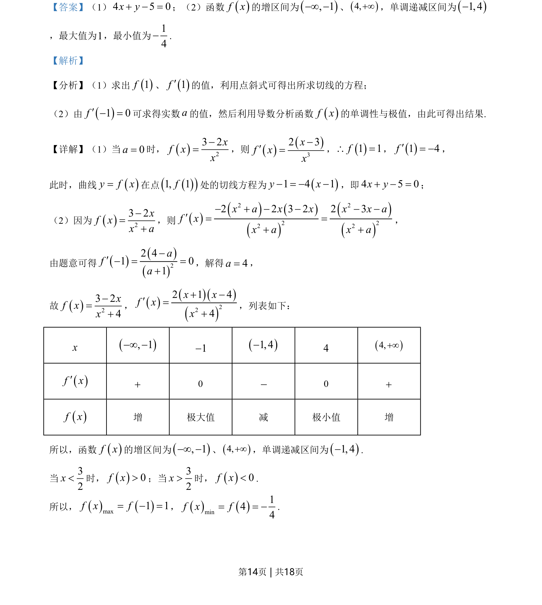

## 题面

## 摘要

考查导数几何意义求切线及利用导数求含参函数单调区间与极值

## 关联考点

- [[440-导数的几何意义|导数的几何意义]]
- [[705-利用导数研究函数的单调性|利用导数研究函数的单调性]]
- [[707-利用导数研究函数的极值|利用导数研究函数的极值]]

## 答案与解析

> 📄 原 PDF 第 14 页：`素材/真题/北京/2008-2024·（北京）数学高考真题/2021年高考数学试卷（北京）（解析卷）.pdf`

<!-- 题干文本-start -->
## 题干文本
19. 已知函数23 2xf xx a-=+
．
（1）若0a=，求y f x=在1, 1f处切线方程；
（2）若函数f x在1x= -处取得极值，求f x的单调区间，以及最大值和最小值．
<!-- 题干文本-end -->

<!-- 解析文本-start -->
## 解析文本
【答案】（1）4 5 0x y+ - =；（2）函数f x的增区间为, 1-¥ -、4,+¥，单调递减区间为1, 4-
，最大值为1，最小值为14-.
【解析】
【分析】（1）求出1f、1f¢的值，利用点斜式可得出所求切线的方程；
（2）由10f¢-=可求得实数a的值，然后利用导数分析函数f x的单调性与极值，由此可得出结果.
【详解】（1）当0a=时，23 2xf xx-=，则32 3xf xx-¢=，1 1f\ =，1 4f¢= -，
此时，曲线y f x=在点1, 1f处的切线方程为1 4 1y x- = - -，即4 5 0x y+ - =；
（2）因为23 2xf xx a-=+
，则2 22 22 22 2 3 2 2 3x a x x x x af xx a x a- + - - - -¢= =+ +
，
由题意可得22 41 01afa-¢- = =+
，解得4a=，
故23 24xf xx-=+
，222 1 44x xf xx+ -¢=+
，列表如下：
x, 1-¥ -1-1, 4-44,+¥f x¢+0-0+f x增 极大值 减 极小值 增
所以，函数f x的增区间为, 1-¥ -、4,+¥，单调递减区间为1, 4-.
当32x<时，0f x>；当32x>时，0f x<.
所以，max1 1f x f= - =，min144f x f= = -.
<!-- 解析文本-end -->
