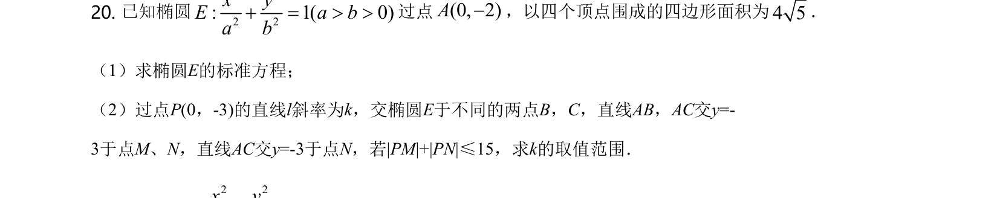
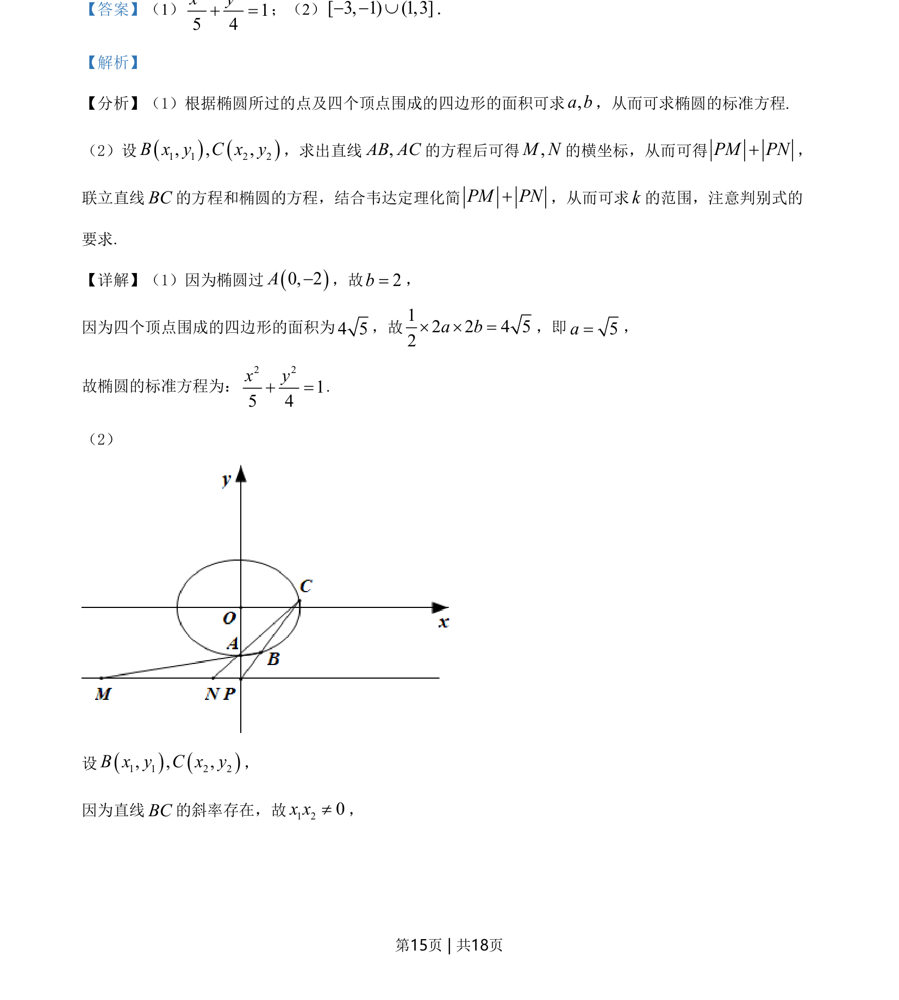
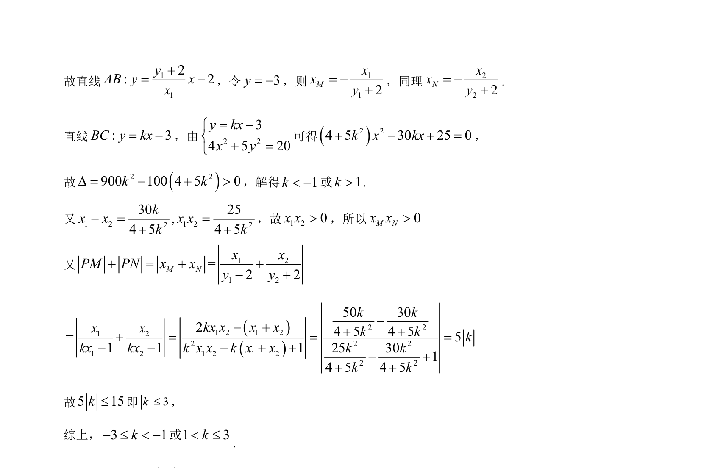

## 题面

## 摘要

考查椭圆标准方程、直线与椭圆位置关系及斜率范围求解

## 关联考点

- [[942-椭圆标准方程|椭圆标准方程]]
- [[直线与椭圆联立]]
- [[234-韦达定理-初中|韦达定理]]
- [[393-直线倾斜角与斜率|斜率]]

## 答案与解析

> 📄 原 PDF 第 15 页：`素材/真题/北京/2008-2024·（北京）数学高考真题/2021年高考数学试卷（北京）（解析卷）.pdf`
