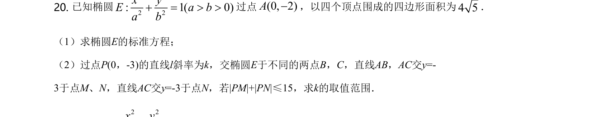
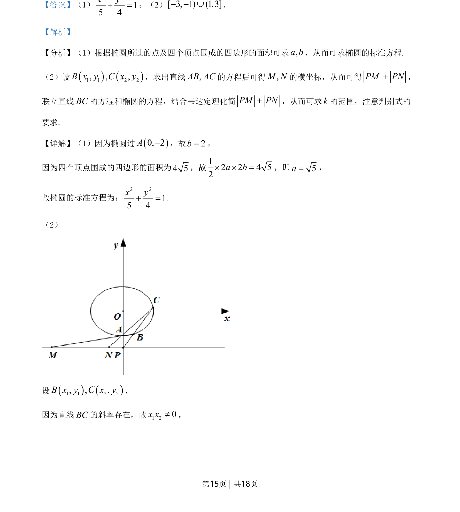
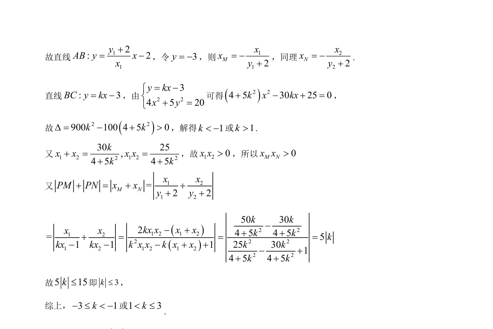

## 题面

## 摘要

考查椭圆标准方程、直线与椭圆位置关系及斜率范围求解

## 关联考点

- [[941-椭圆标准方程|椭圆标准方程]]
- [[直线与椭圆联立]]
- [[234-韦达定理-初中|韦达定理]]
- [[393-直线倾斜角与斜率|斜率]]

## 答案与解析

> 📄 原 PDF 第 15 页：`素材/真题/北京/2008-2024·（北京）数学高考真题/2021年高考数学试卷（北京）（解析卷）.pdf`

<!-- 题干文本-start -->
## 题干文本
20. 已知椭圆
2 22 2: 1( 0)x yE a ba b+ = > >过点(0, 2)A-，以四个顶点围成的四边形面积为4 5．
（1）求椭圆E的标准方程；
（2）过点P(0，-3)的直线l斜率为k，交椭圆E于不同的两点B，C，直线AB，AC交y=-
3于点M、N，直线AC交y=-3于点N，若|PM|+|PN|≤15，求k的取值范围．
<!-- 题干文本-end -->

<!-- 解析文本-start -->
## 解析文本
【答案】（1）
2 215 4x y+ =；（2）[ 3, 1) (1,3]- - È．
【解析】
【分析】（1）根据椭圆所过的点及四个顶点围成的四边形的面积可求,a b，从而可求椭圆的标准方程.
（2）设1 1 2 2, , ,B x y C x y，求出直线,AB AC的方程后可得,M N的横坐标，从而可得PM PN+，
联立直线BC的方程和椭圆的方程，结合韦达定理化简PM PN+，从而可求k的范围，注意判别式的
要求.
【详解】（1）因为椭圆过0, 2A-，故2b=，
因为四个顶点围成的四边形的面积为4 5，故12 2 4 52a b´ ´ =，即5a=，
故椭圆的标准方程为：
2 215 4x y+ =.
（2）
设1 1 2 2, , ,B x y C x y，
因为直线BC的斜率存在，故1 20x x¹，
<!-- 解析文本-end -->
